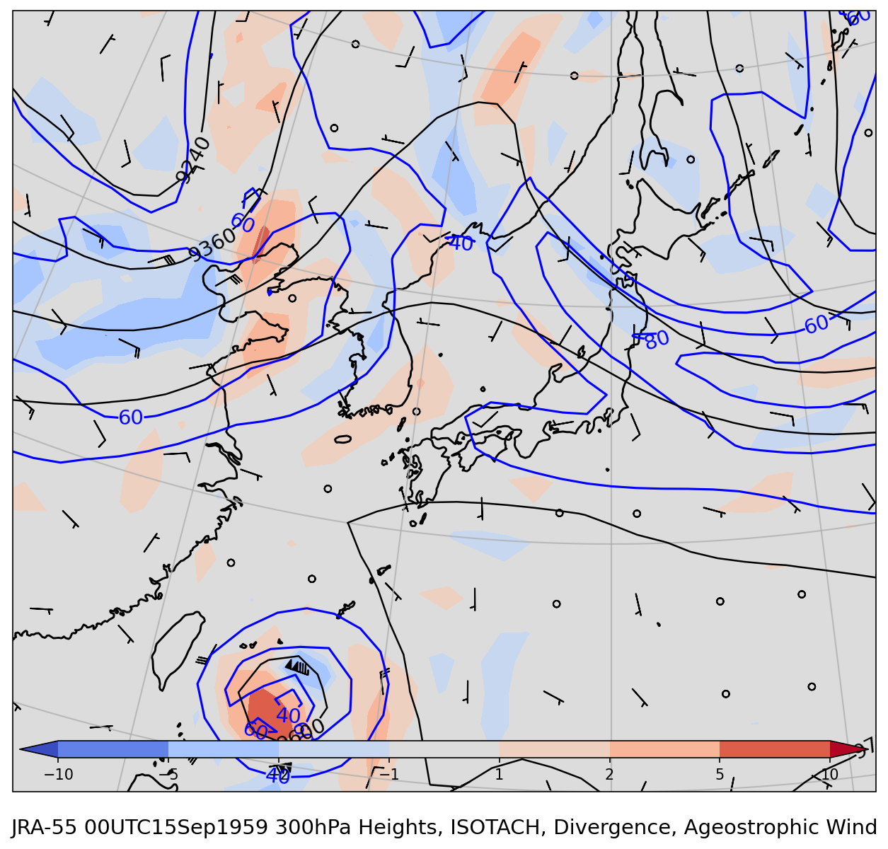
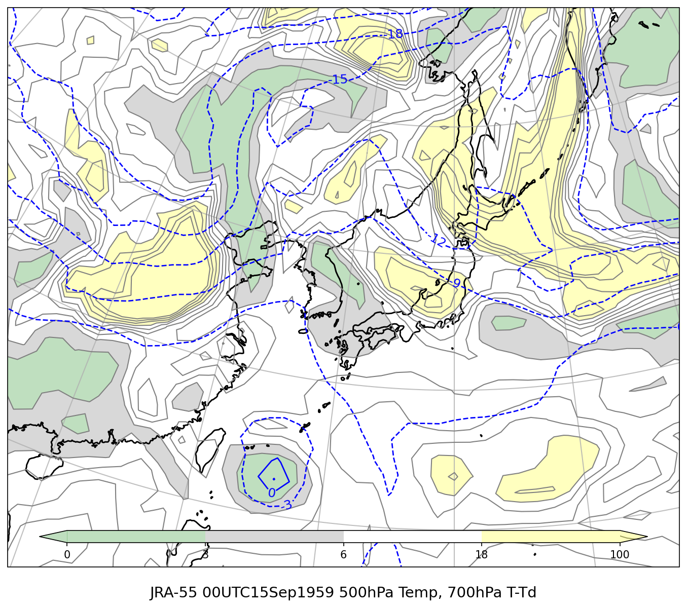
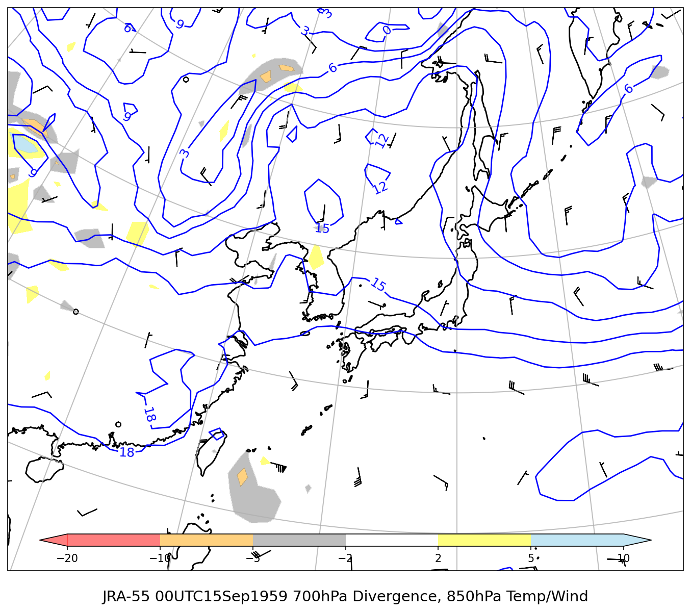
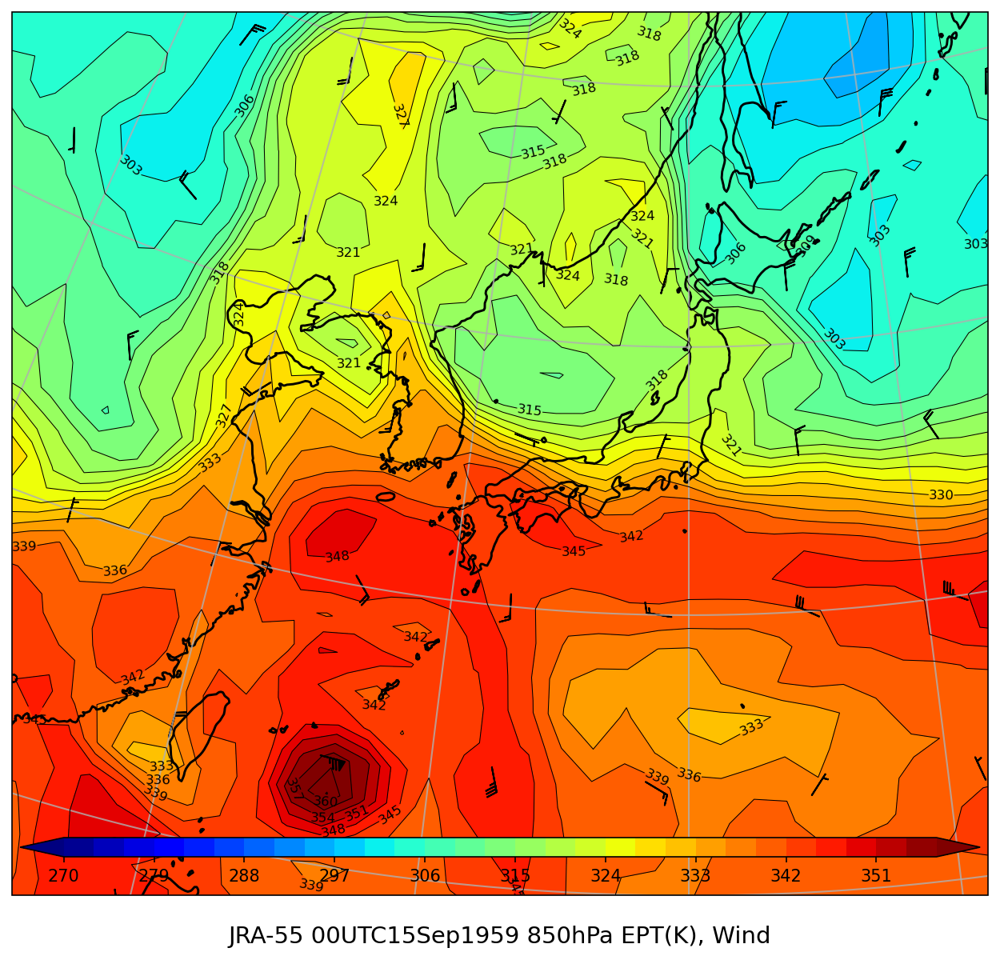
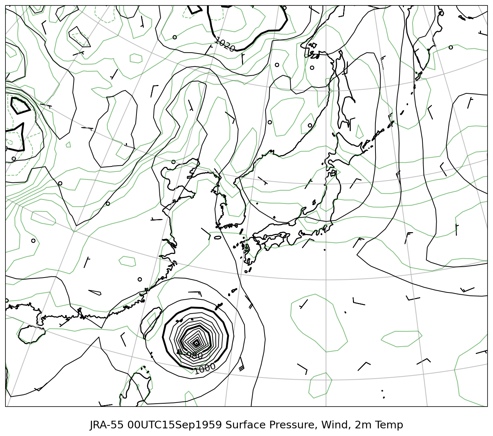

# JRA-55 総観天気図レポート

**対象時刻**: 1959/09/15 00UTC

---

## Jet 300hPa（等風速・発散・非地衡風）

---

## 500/700hPa（500hPa気温・700hPa湿数）

---

## 700/850hPa（700hPa発散・850hPa気温風）

---

## 850hPa 相当温位・風

---

## 地上気圧・風・地上気温

---
