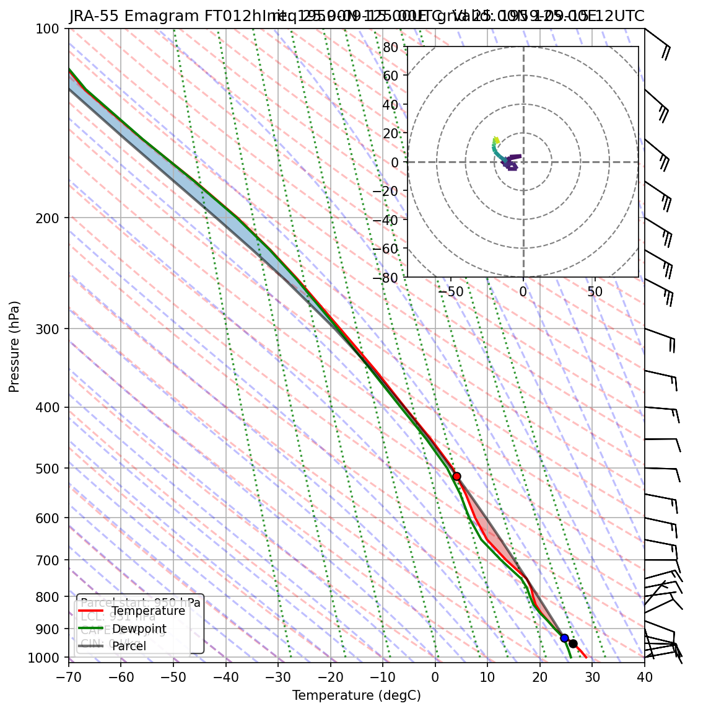
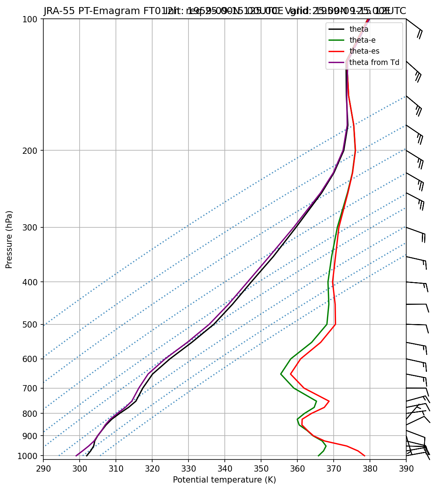
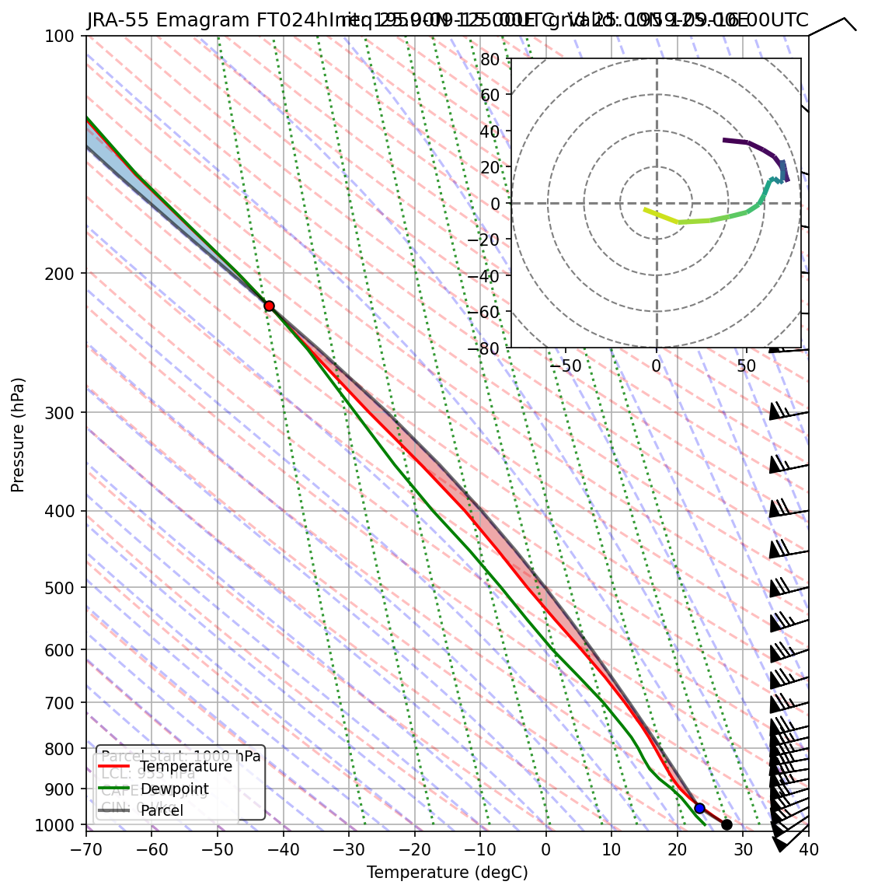
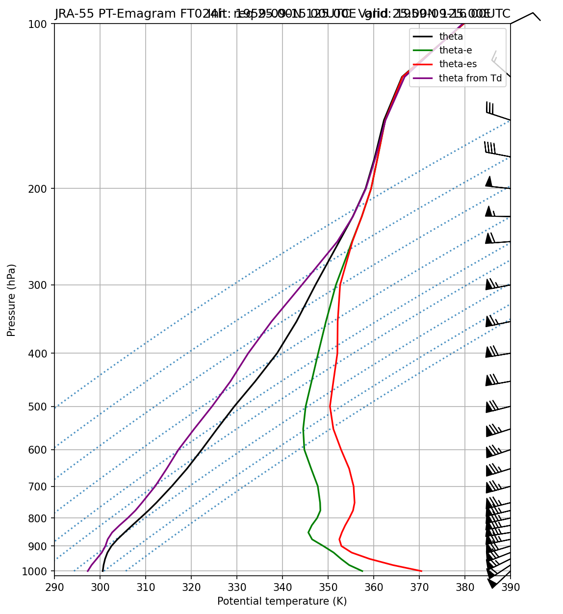

# JRA-55 エマグラム

**初期時刻**: 1959/09/15 00UTC
**地点**: req 25.00N 125.00E
**FT**: FT012-024h

---

## FT=012h

**有効時刻**: 1959/09/15 12UTC  
**格子点**: 25.00N 125.00E

### エマグラム

### 温位エマグラム

---

## FT=024h

**有効時刻**: 1959/09/16 00UTC  
**格子点**: 25.00N 125.00E

### エマグラム

### 温位エマグラム

---
