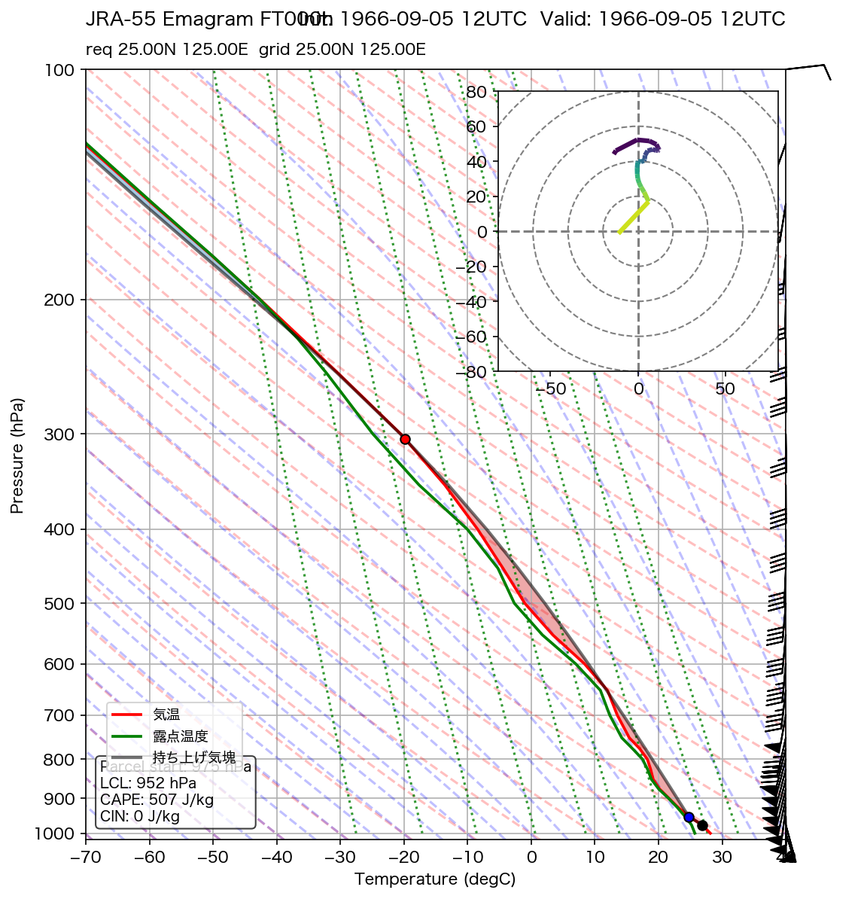
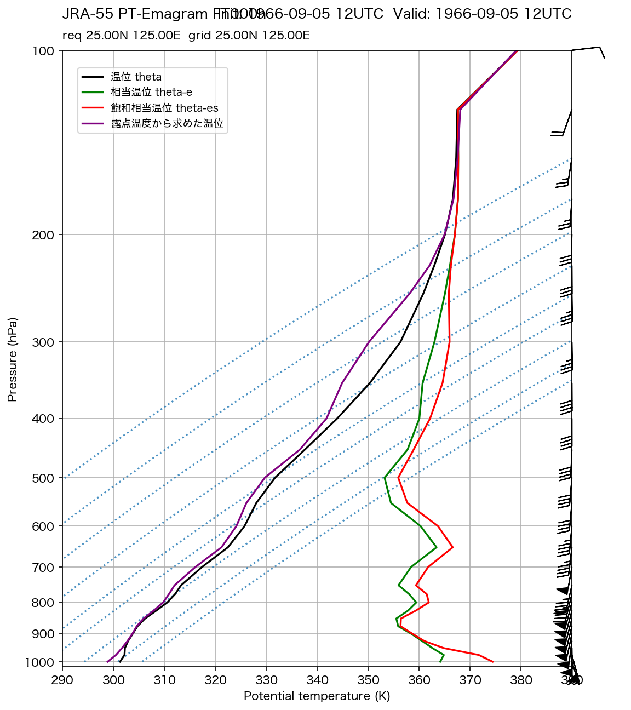
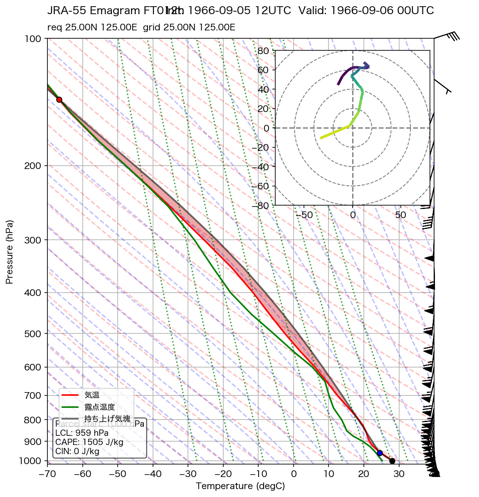
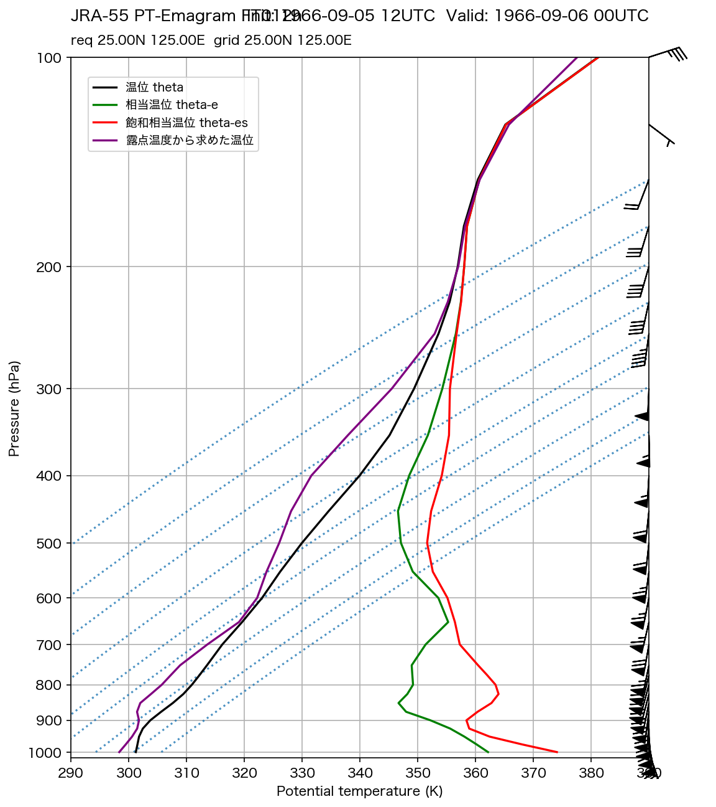

# JRA-55 エマグラム

**初期時刻**: 1966/09/05 12UTC
**地点**: req 25.00N 125.00E
**FT**: FT000-012h

---

## FT=000h

**有効時刻**: 1966/09/05 12UTC  
**格子点**: 25.00N 125.00E

### エマグラム

### 温位エマグラム

---

## FT=012h

**有効時刻**: 1966/09/06 00UTC  
**格子点**: 25.00N 125.00E

### エマグラム

### 温位エマグラム

---
