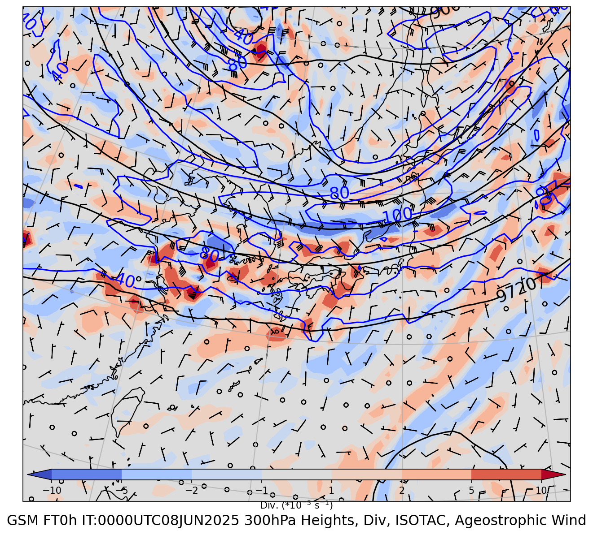
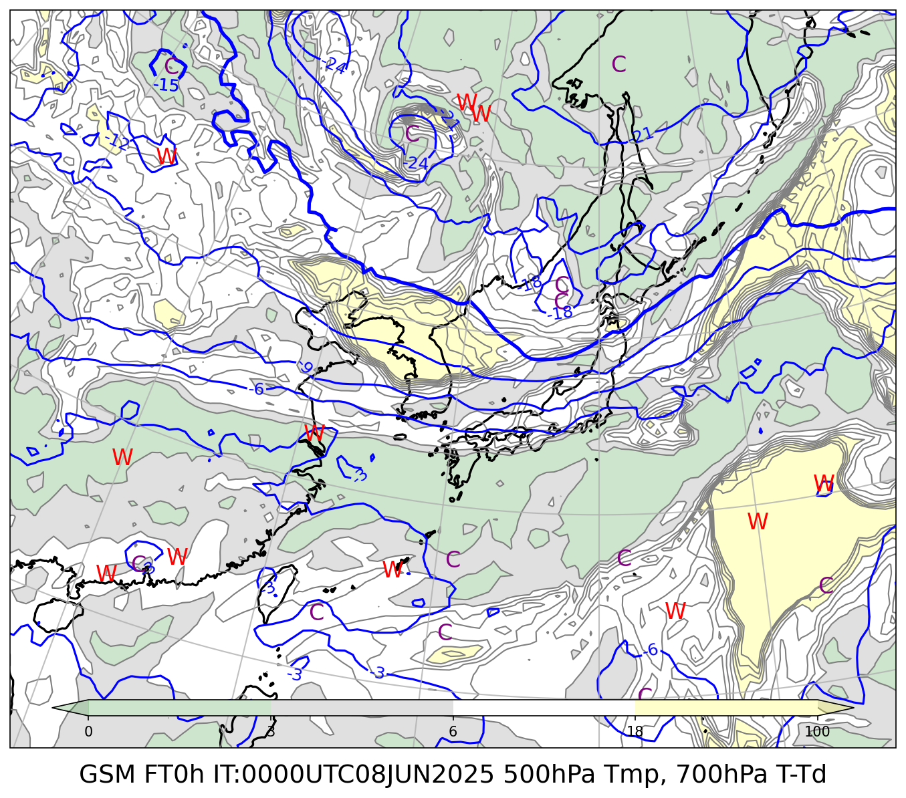
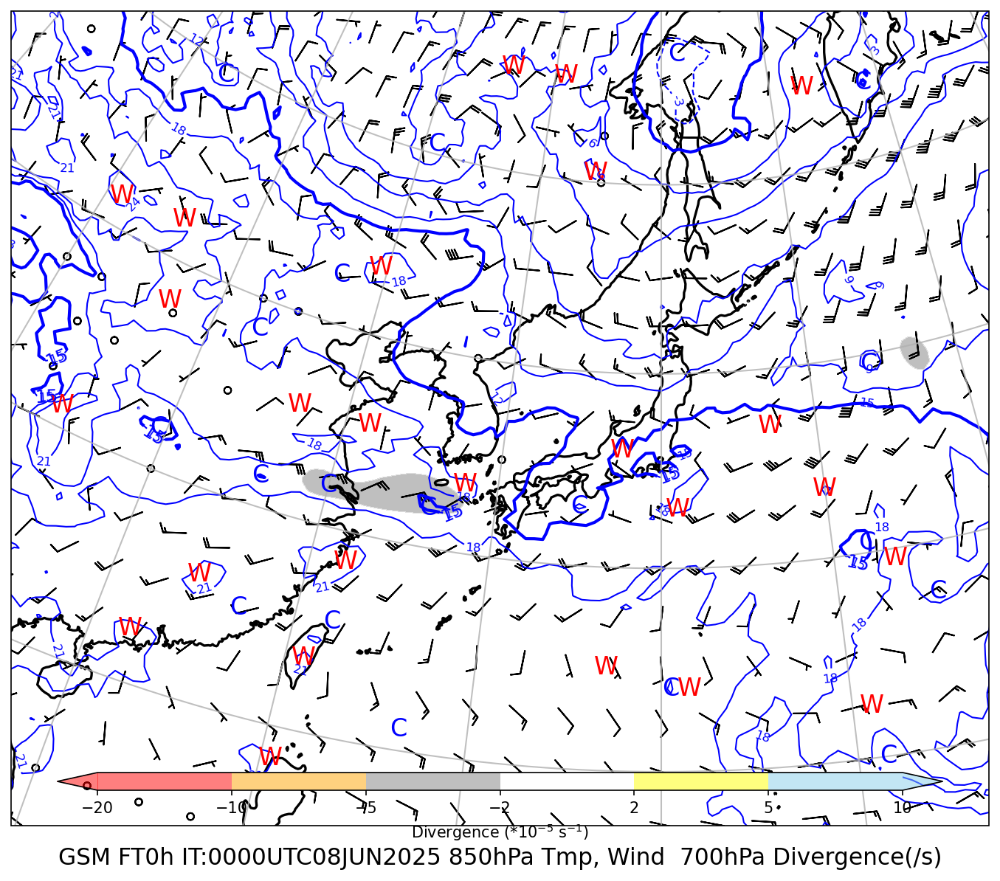
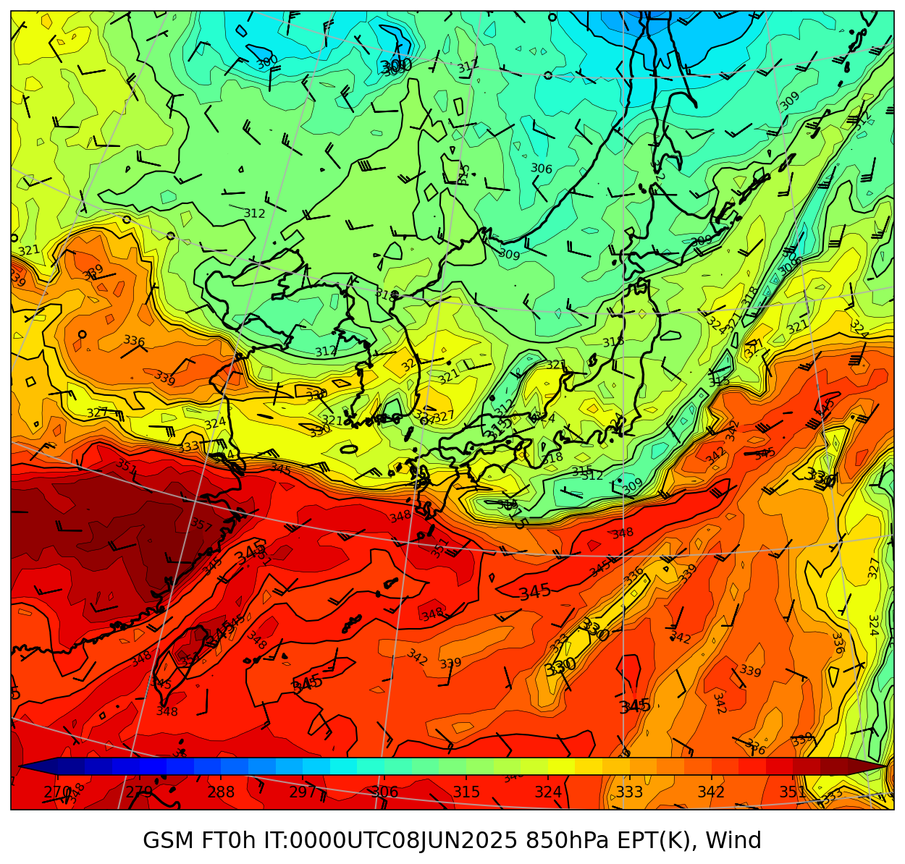
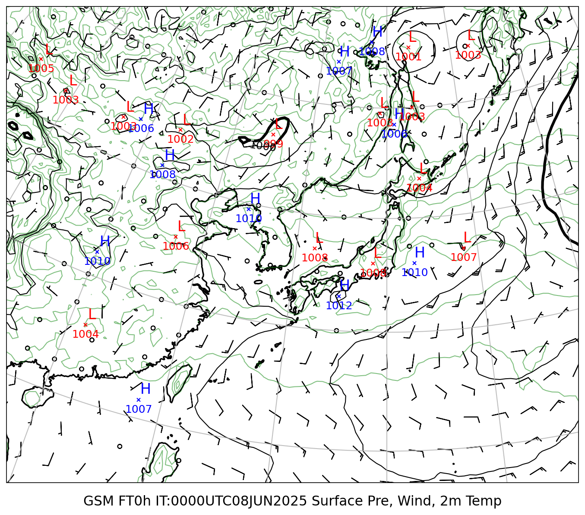

# 総観天気図レポート

**初期時刻**: 2025/06/08 00UTC

---

## Jet 300hPa

### GSM（Isotach・非地衡風・高度）

#### FT=0h

---

## 500/700hPa（等高度線・渦度・風）

### GSM

#### FT=0h

---

## 700/850hPa（等高度線・相当温位・風）

### GSM

#### FT=0h

---

## 850hPa 相当温位・風矢羽

### GSM

#### FT=0h

---

## 地上気圧・10m風・2m気温

### GSM

#### FT=0h

---
