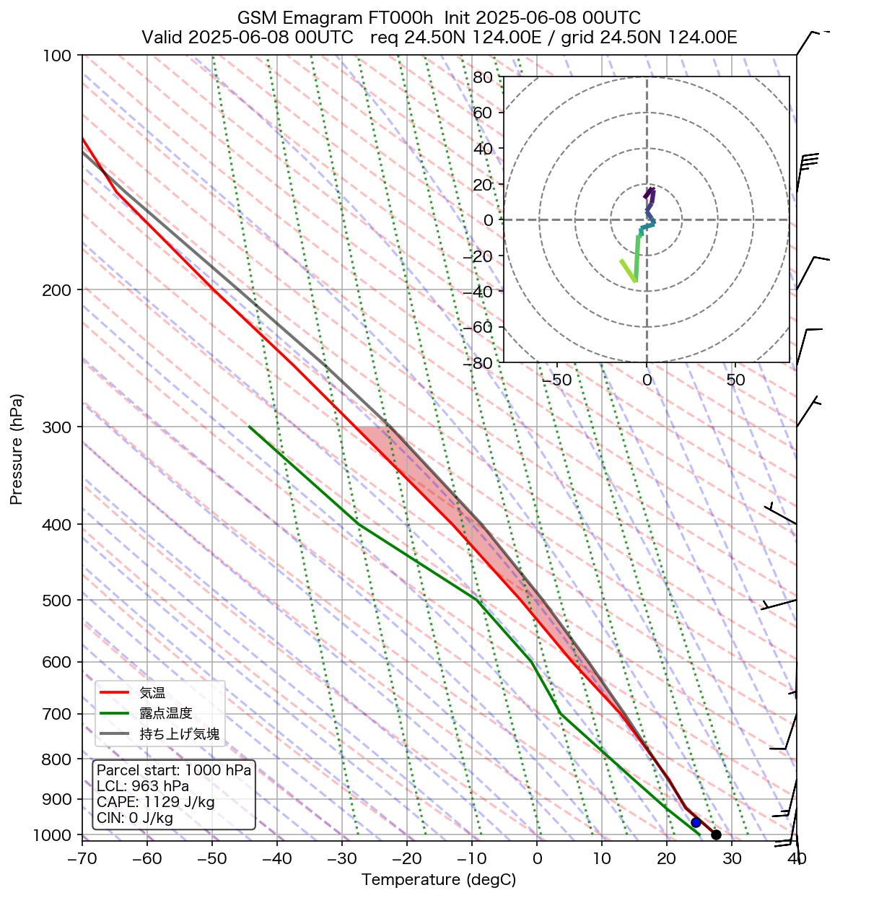
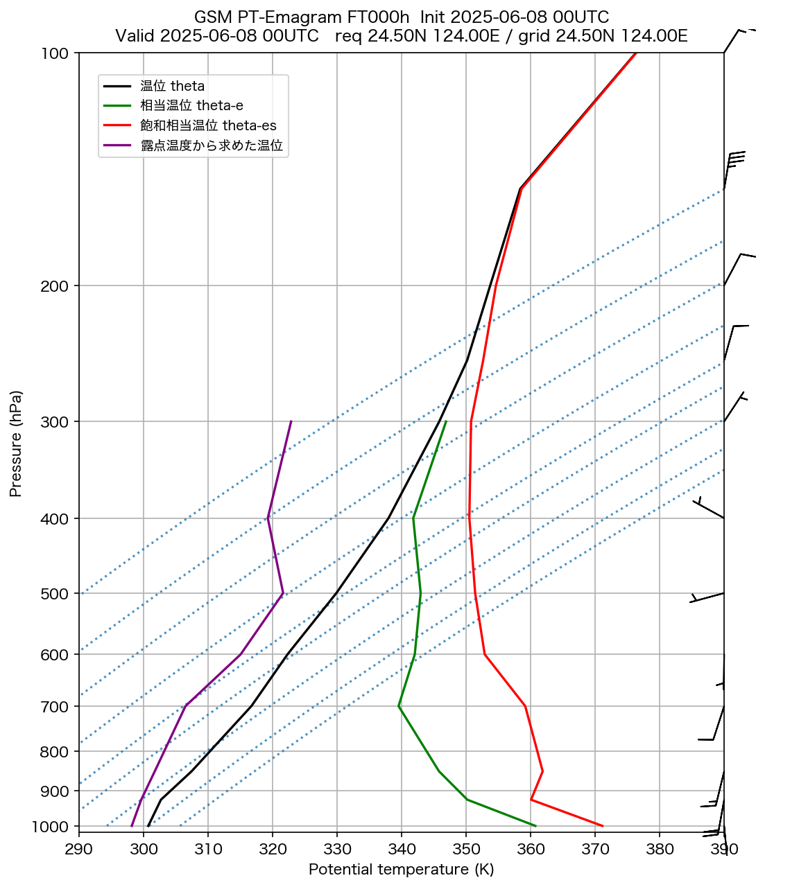

# GSM エマグラム

**初期時刻**: 2025/06/08 00UTC
**地点**: req 24.50N 124.00E
**FT**: FT000h

---

## FT=000h

**有効時刻**: 2025/06/08 00UTC  
**格子点**: 24.50N 124.00E  
**入力ファイル**: `Z__C_RJTD_20250608000000_GSM_GPV_Rgl_FD0000_grib2.bin`

### エマグラム

### 温位エマグラム

---
