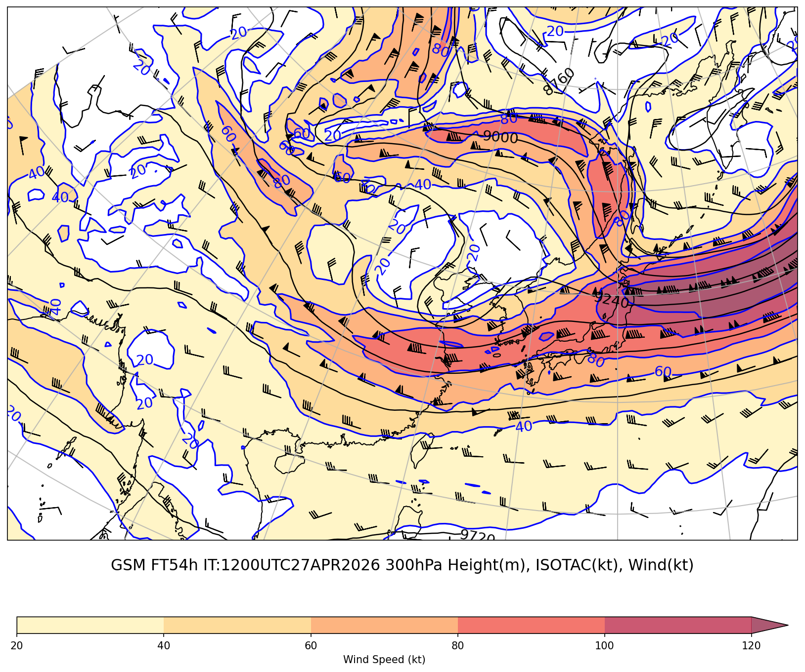
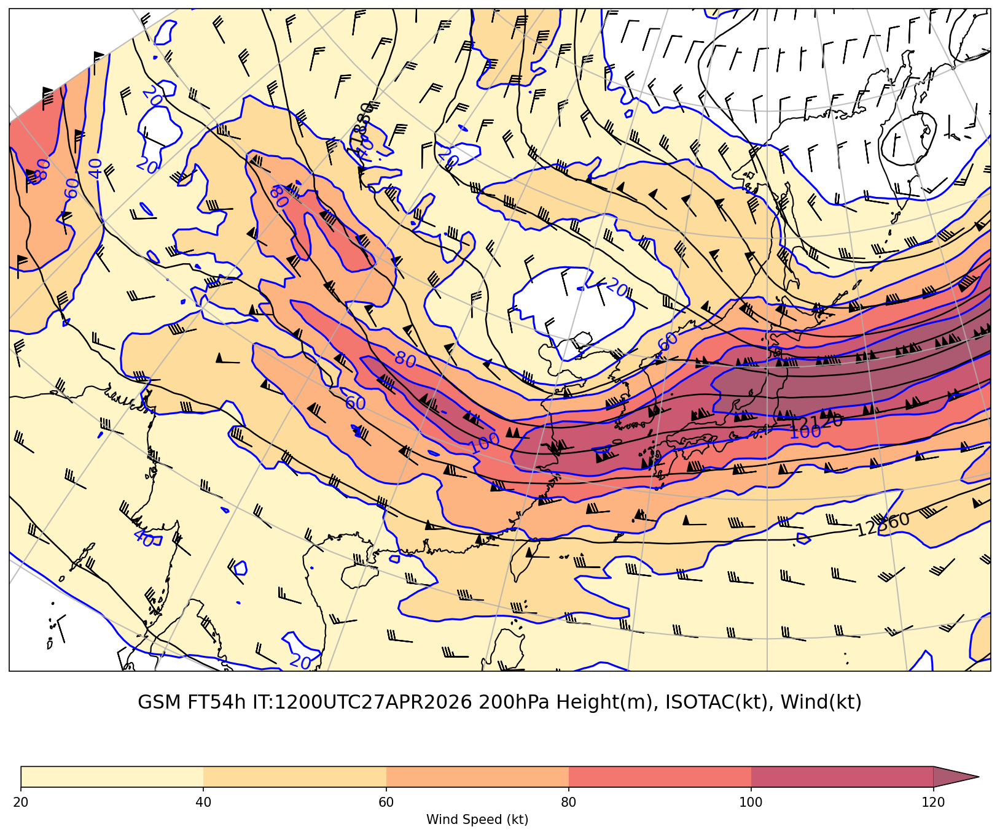
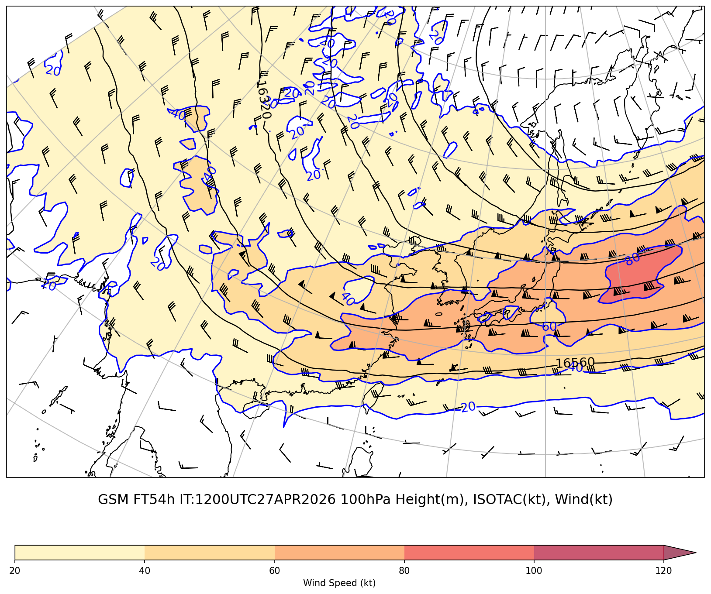
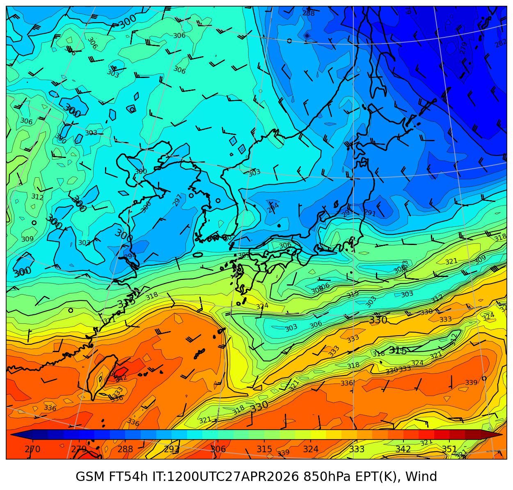
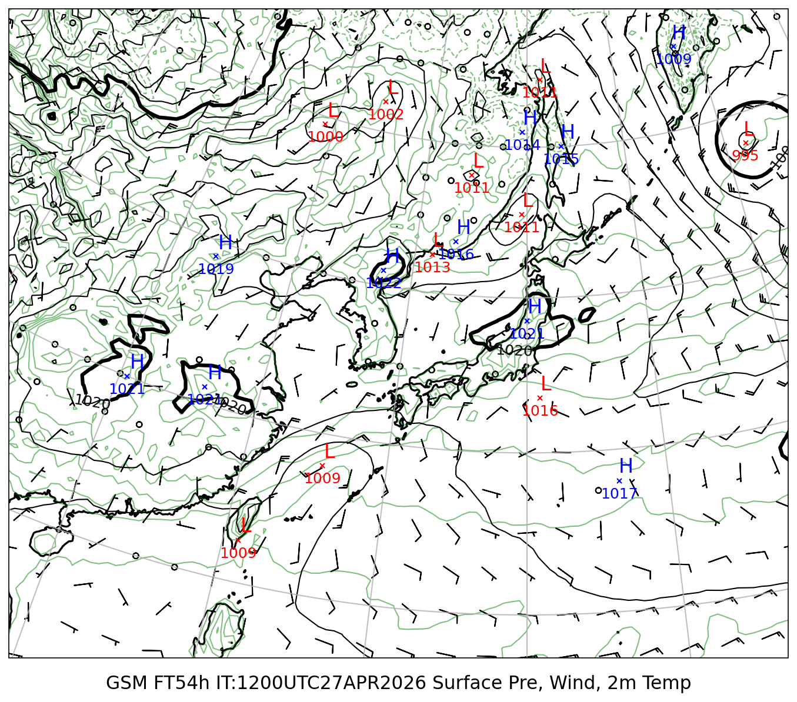

# ジェット・前線解析レポート

**初期時刻**: 2026/04/27 12UTC  **断面**: 45°N〜25°N / 130°E（経線断面）

---

## 上層風（300hPa+200hPa+100hPa）

### GSM 300hPa

#### FT=54h

### GSM 200hPa

#### FT=54h

### GSM 100hPa

#### FT=54h

---

## 850hPa 相当温位・風矢羽

### GSM

#### FT=54h

---

## 地上気圧・10m風・2m気温

### GSM

#### FT=54h

---
