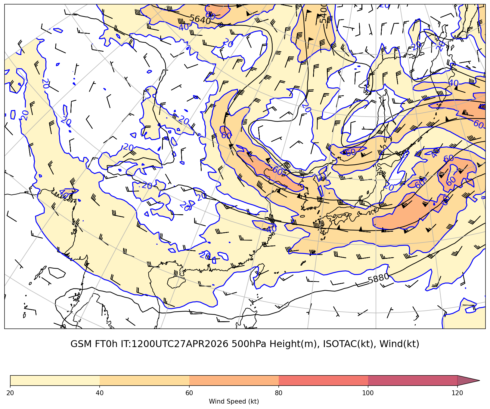
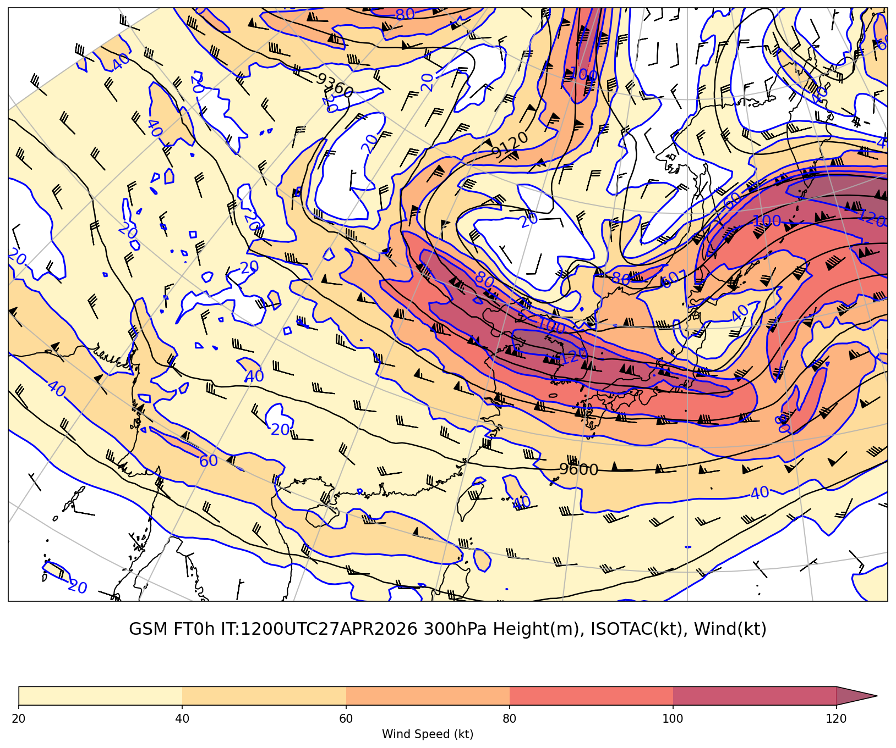

# 上層天気図レポート (500hPa+300hPa+200hPa+100hPa+50hPa)

**初期時刻**: 2026/04/27 12UTC

---

## 500hPa 高度・風矢羽

### GSM 500hPa

#### FT=0h

---

## 300hPa 高度・風矢羽

### GSM 300hPa

#### FT=0h

---

## 200hPa 高度・風矢羽

### GSM 200hPa

#### FT=0h

---

## 100hPa 高度・風矢羽

### GSM 100hPa

#### FT=0h

---

## 50hPa 高度・風矢羽

### GSM 50hPa

#### FT=0h

---
