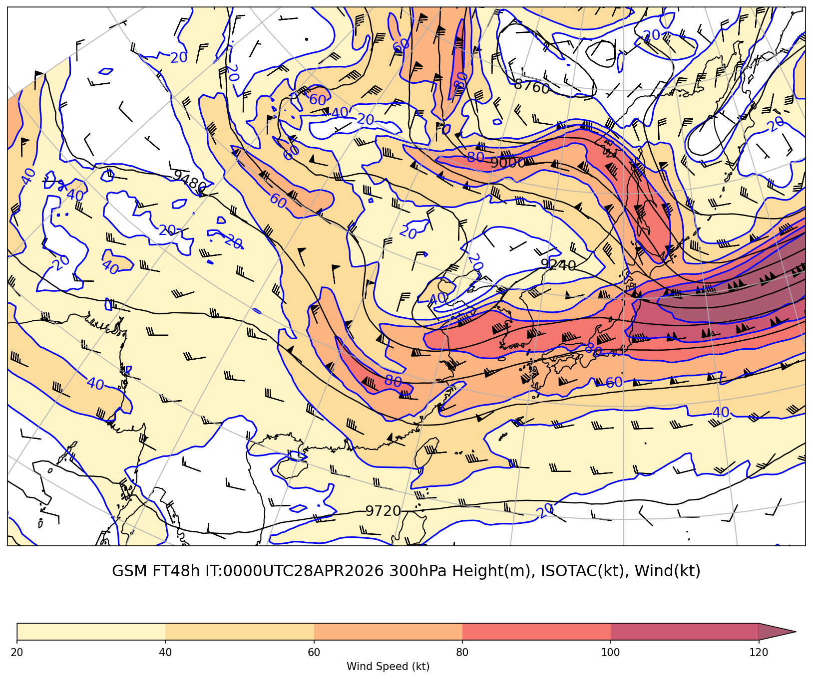
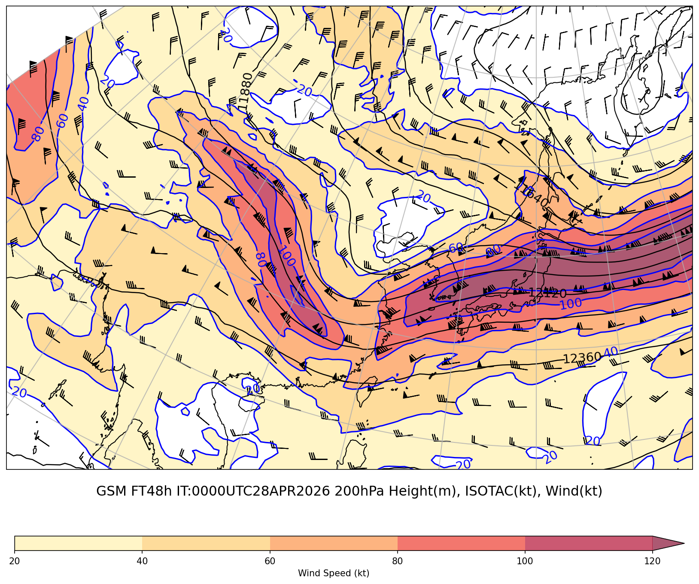
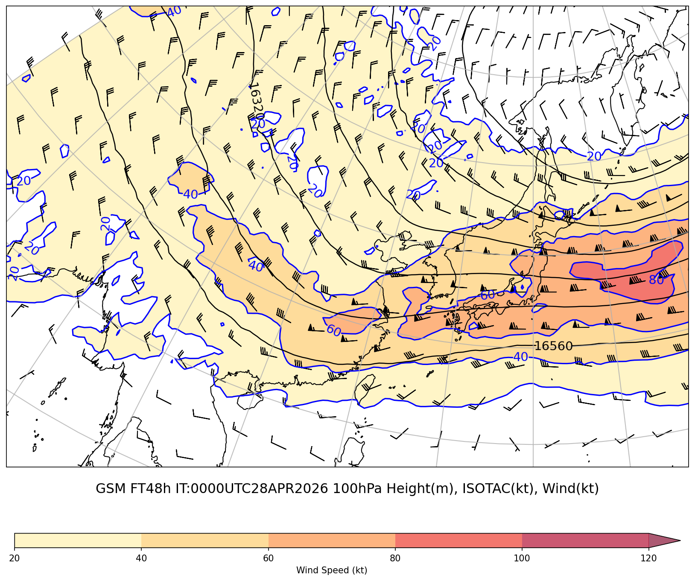
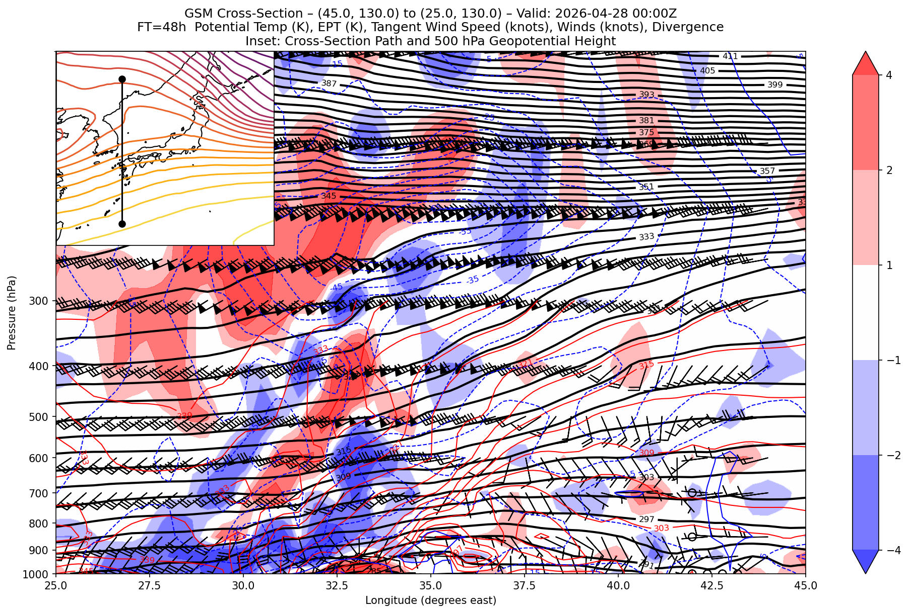
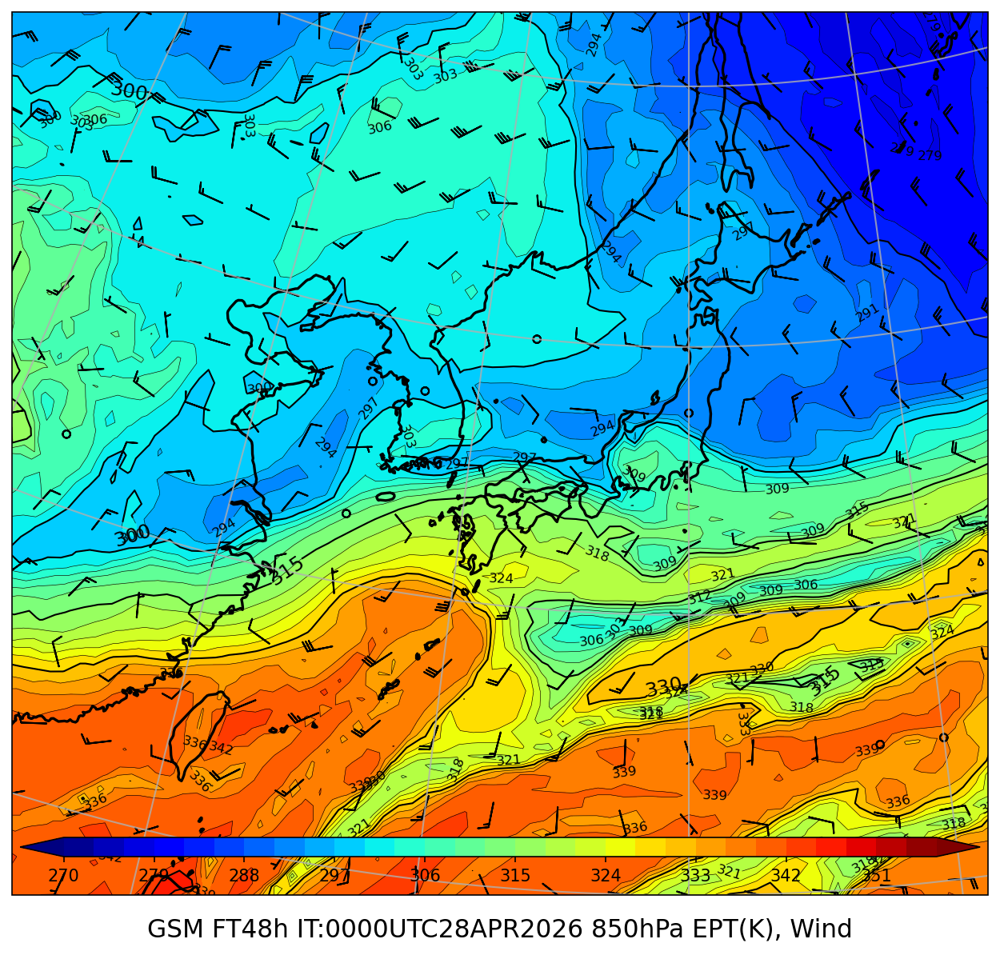
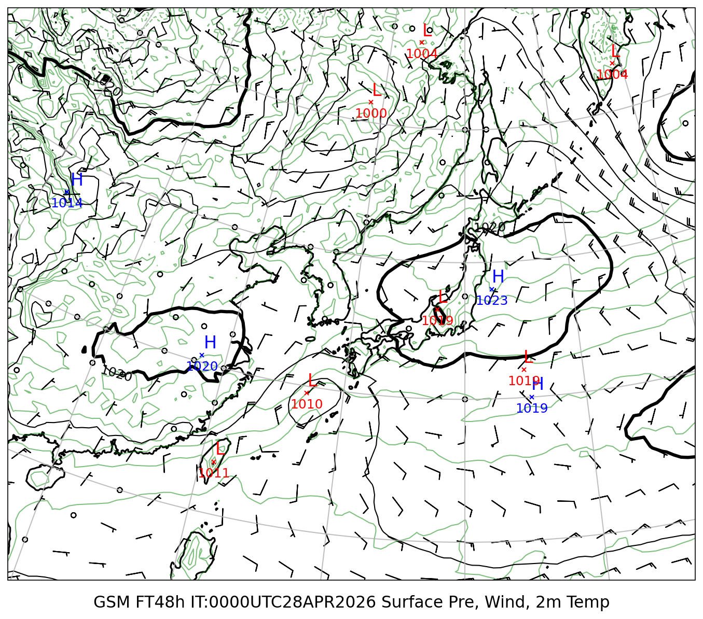

# ジェット・前線解析レポート

**初期時刻**: 2026/04/28 00UTC  **断面**: 45°N〜25°N / 130°E（経線断面）

---

## 上層風（300hPa+200hPa+100hPa）

### GSM 300hPa

#### FT=48h

### GSM 200hPa

#### FT=48h

### GSM 100hPa

#### FT=48h

---

## 鉛直断面図（45°N〜25°N / 130°E（経線断面））

*(GSM。ポテンシャル温位・相当温位・風・発散)*

### FT=48h

*カラー: 発散（正値が赤系、負値は青系）、等温位線（黒）、等相当温位線（赤）、断面に沿った等風速線（青）、風矢羽（黒）*

---

## 850hPa 相当温位・風矢羽

### GSM

#### FT=48h

---

## 地上気圧・10m風・2m気温

### GSM

#### FT=48h

---
