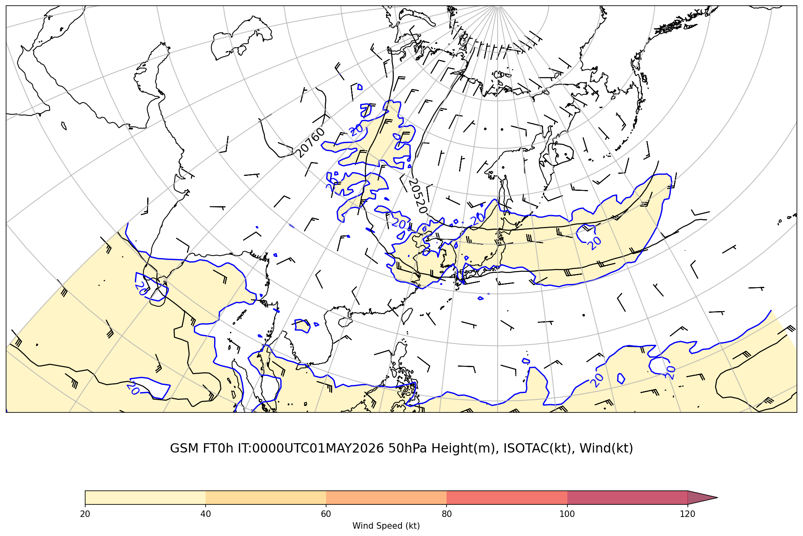
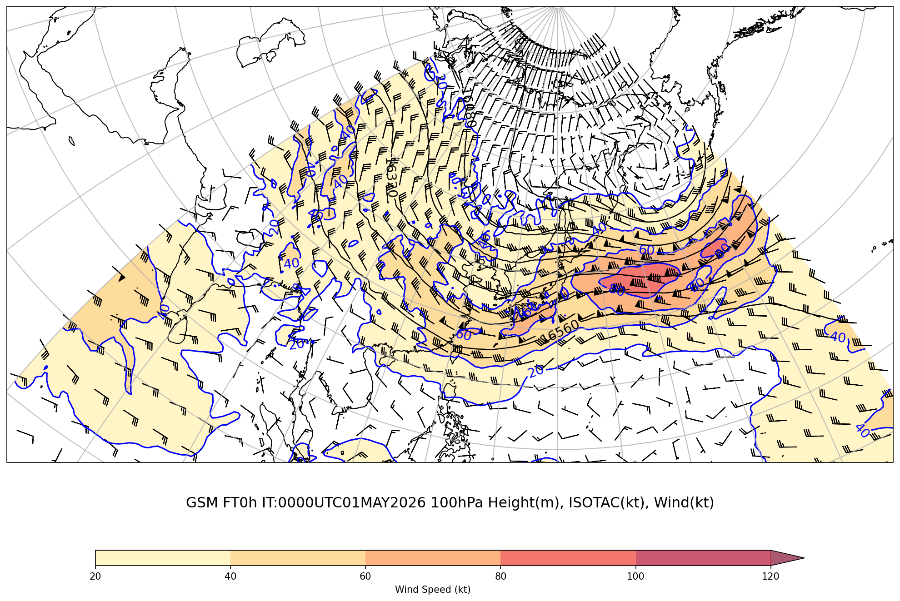
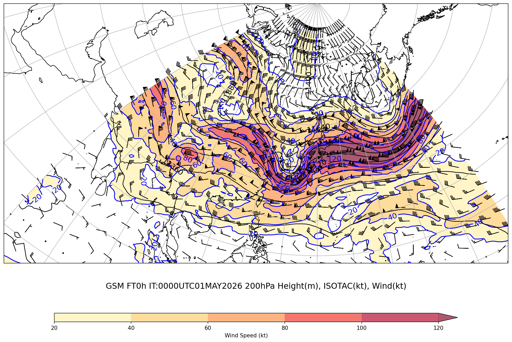
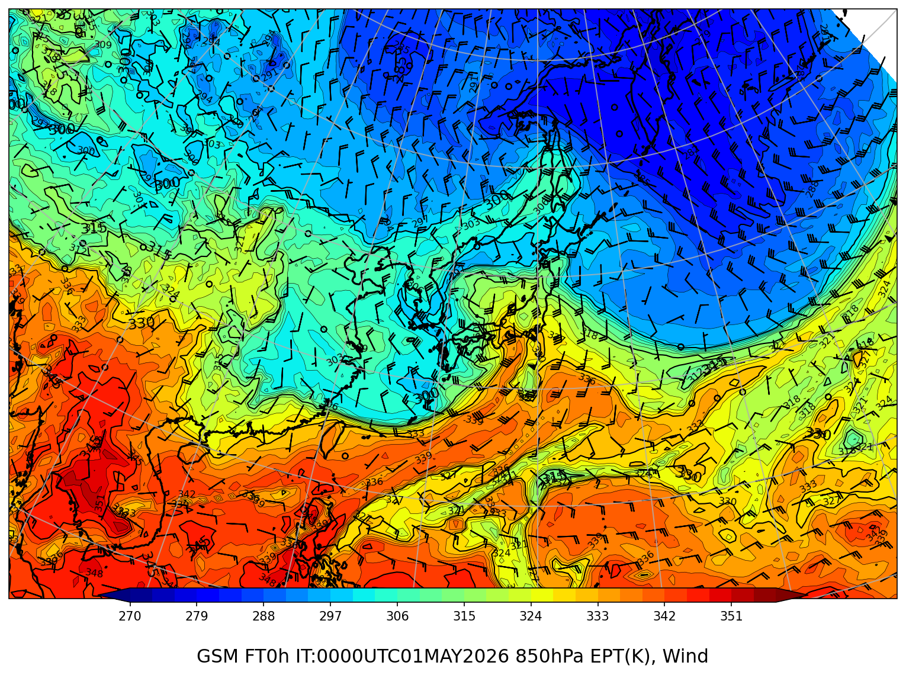

# ジェット・前線解析ワイドレポート

**初期時刻**: 2026/05/01 00UTC

*(描画領域: 上層 [48, 192, 7.5, 64.5]、850hPa [97, 169, 12.5, 57.5])*

---

## 上層風（50hPa+100hPa+200hPa）

### GSM 50hPa

#### FT=0h

### GSM 100hPa

#### FT=0h

### GSM 200hPa

#### FT=0h

---

## 850hPa 相当温位・風矢羽

### GSM

#### FT=0h

---
