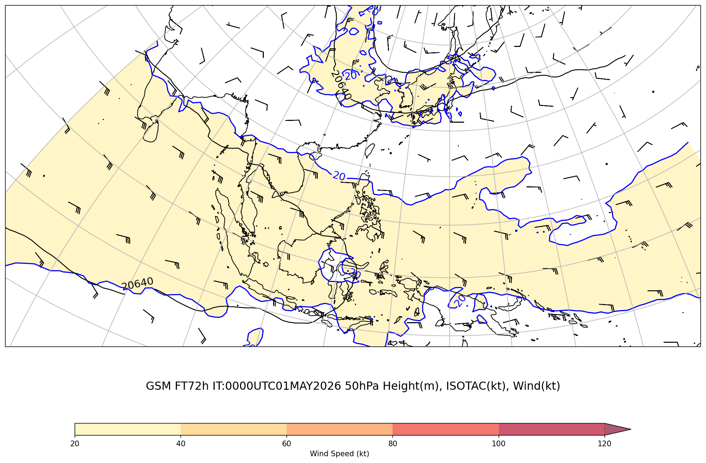
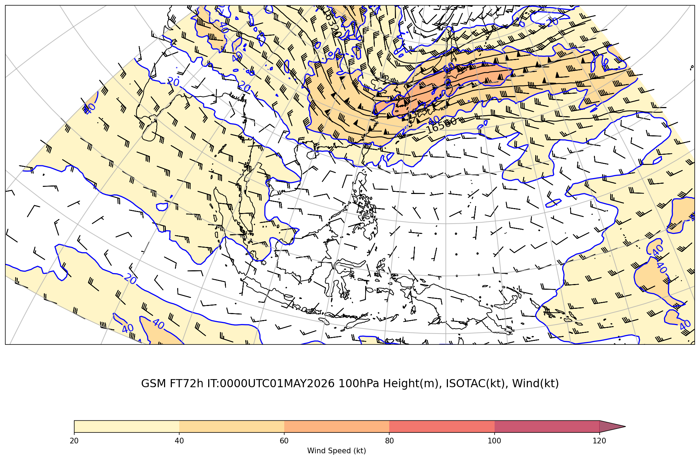
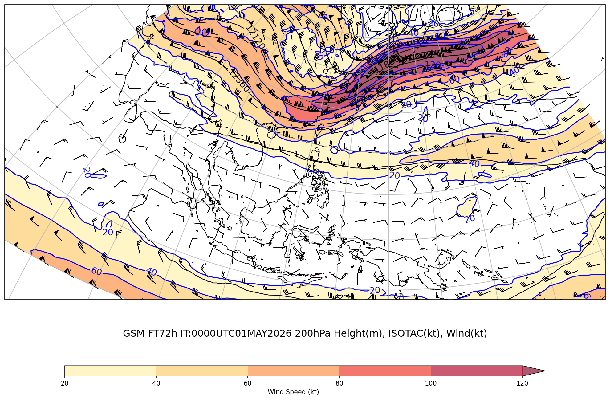
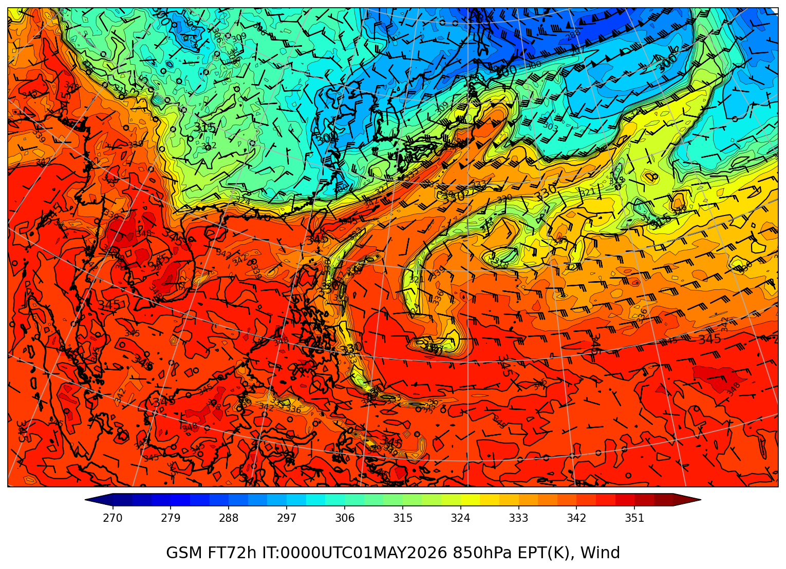

# ジェット・前線解析ワイドレポート

**初期時刻**: 2026/05/01 00UTC

*(描画領域: 上層 lonW=70 lonE=180 latS=-12 latN=30、850hPa lonW=97 lonE=169 latS=-2.5 latN=42.5)*

---

## 上層風（50hPa+100hPa+200hPa）

### GSM 50hPa

#### FT=72h

### GSM 100hPa

#### FT=72h

### GSM 200hPa

#### FT=72h

---

## 850hPa 相当温位・風矢羽

### GSM

#### FT=72h

---
