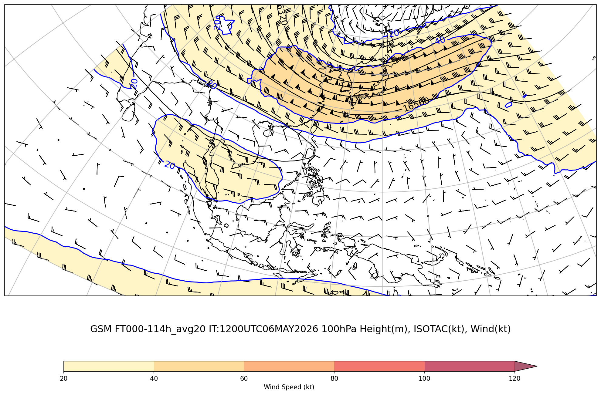
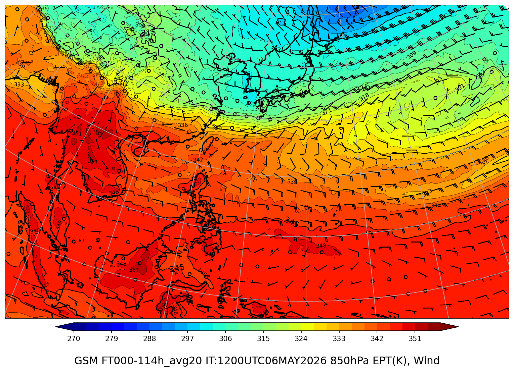

# ジェット・前線解析（広域）

**初期時刻**: 2026/05/06 12UTC

*(描画領域: 上層 lonW=70 lonE=180 latS=-12 latN=30、850hPa lonW=97 lonE=169 latS=-2.5 latN=42.5)*

---

## 上層風（100hPa）

### GSM 100hPa

#### FT=000-114h (avg20)

---

## 850hPa 相当温位・風矢羽

### GSM

#### FT=000-114h (avg20)

---
