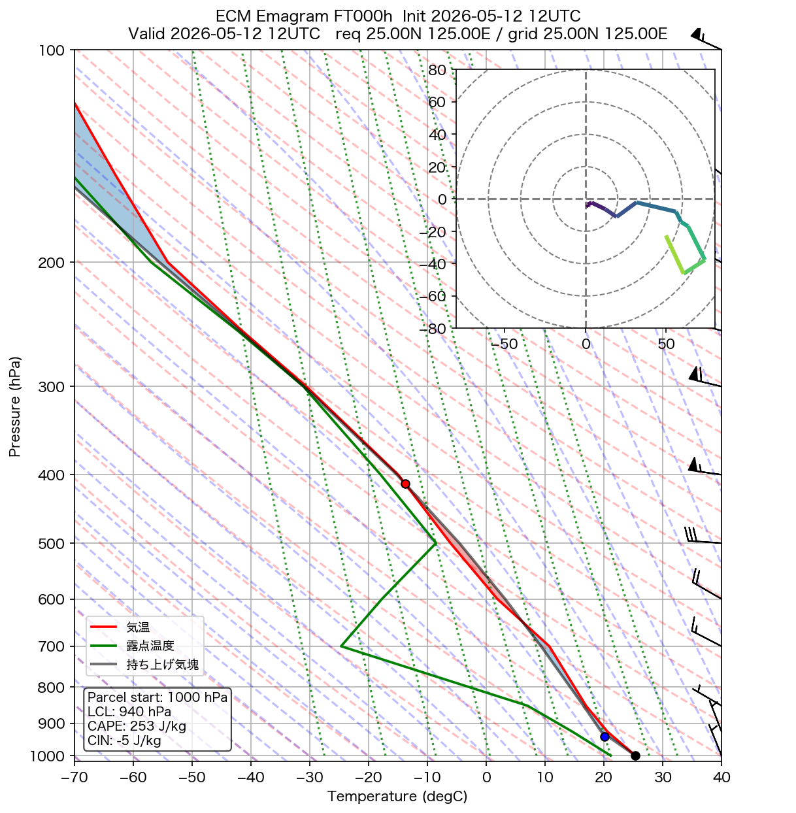
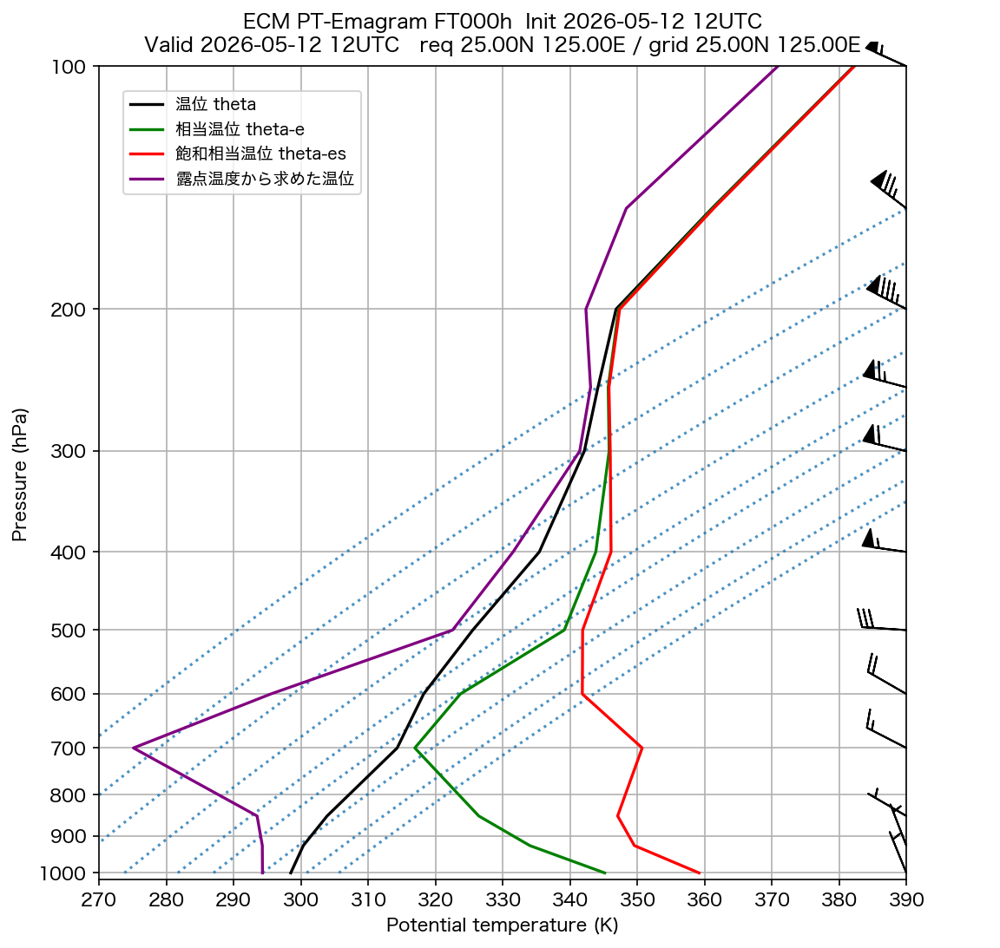

# ECM エマグラム

**初期時刻**: 2026/05/12 12UTC
**地点**: req 25.00N 125.00E
**FT**: FT000h

---

## FT=000h

**有効時刻**: 2026/05/12 12UTC  
**格子点**: 25.00N 125.00E  
**入力ファイル**: `20260512120000-0h-oper-fc.grib2`

### エマグラム

### 温位エマグラム

---
