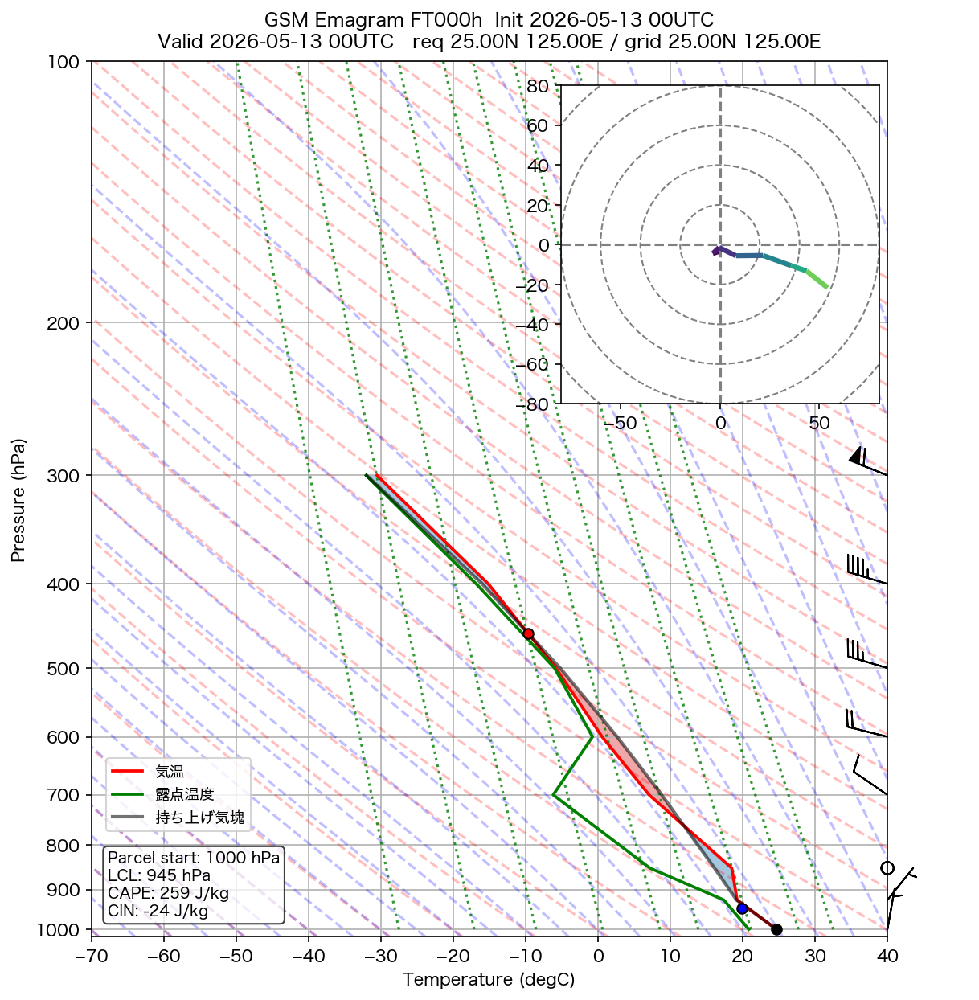
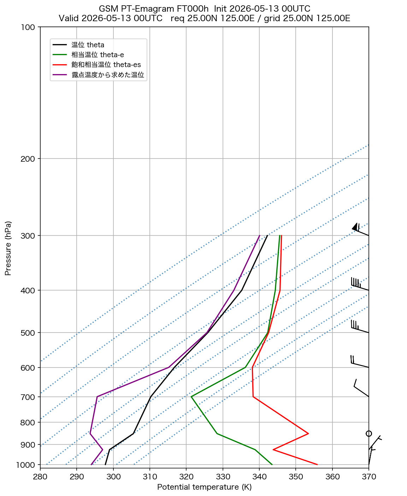

# GSM エマグラム

**初期時刻**: 2026/05/13 00UTC
**地点**: req 25.00N 125.00E
**FT**: FT000h

---

## FT=000h

**有効時刻**: 2026/05/13 00UTC  
**格子点**: 25.00N 125.00E  
**入力ファイル**: `Z__C_RJTD_20260513000000_GSM_GPV_Rgl_FD0000_grib2.bin`

### エマグラム

### 温位エマグラム

---
