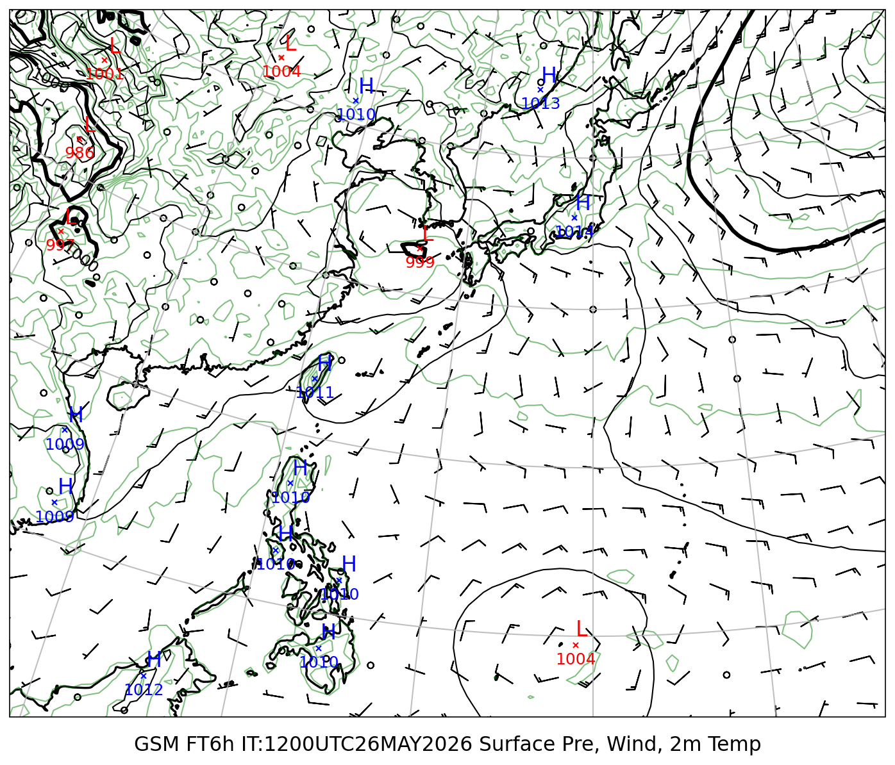
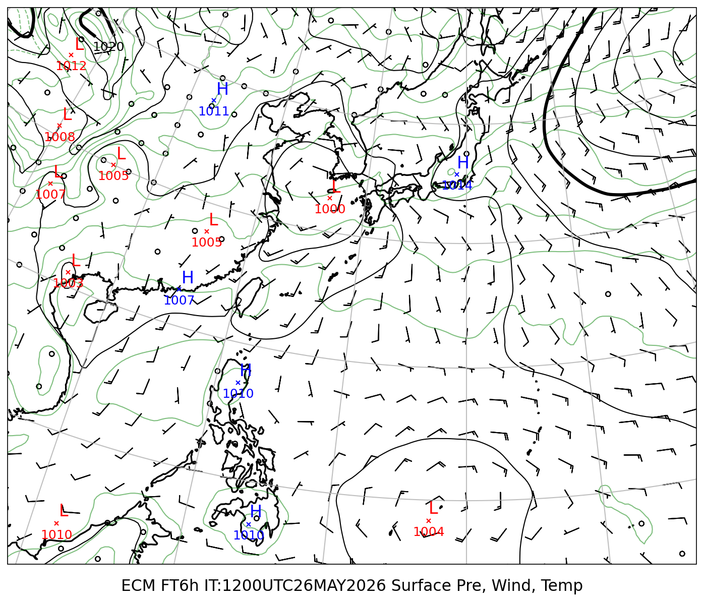
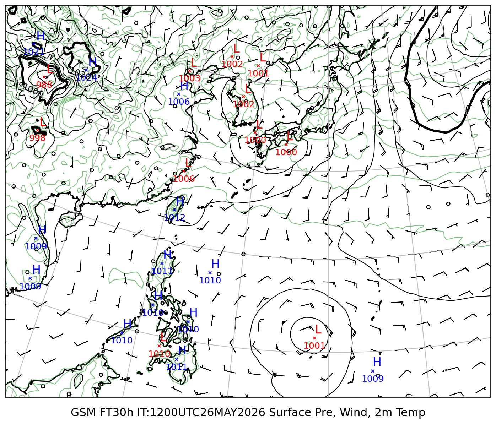
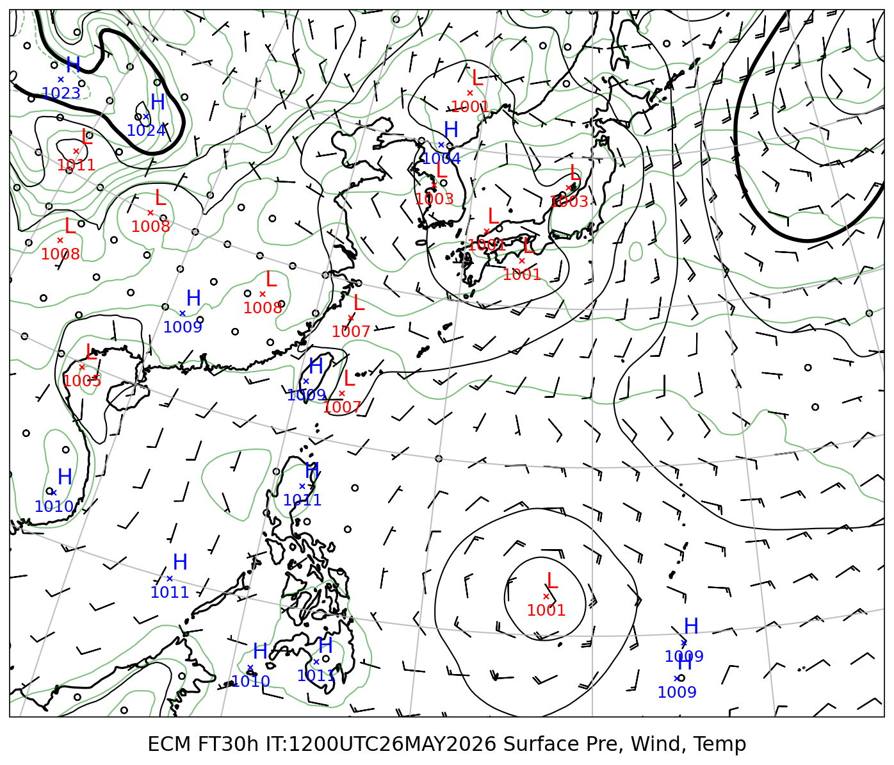
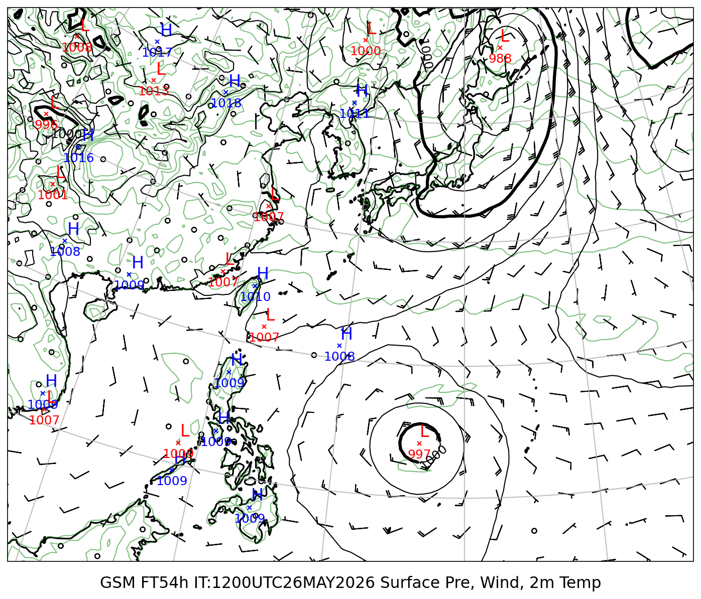
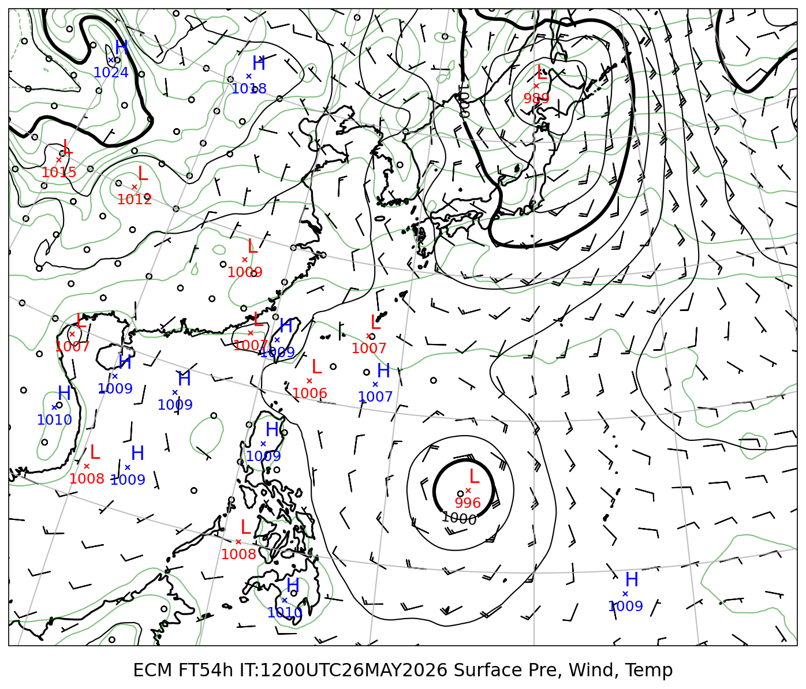
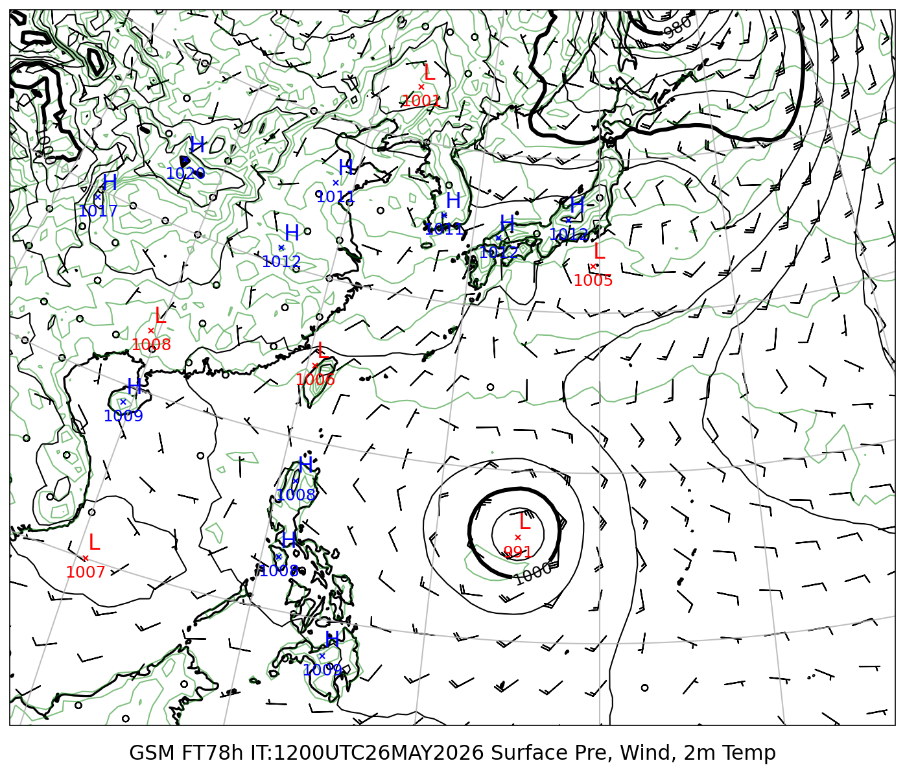
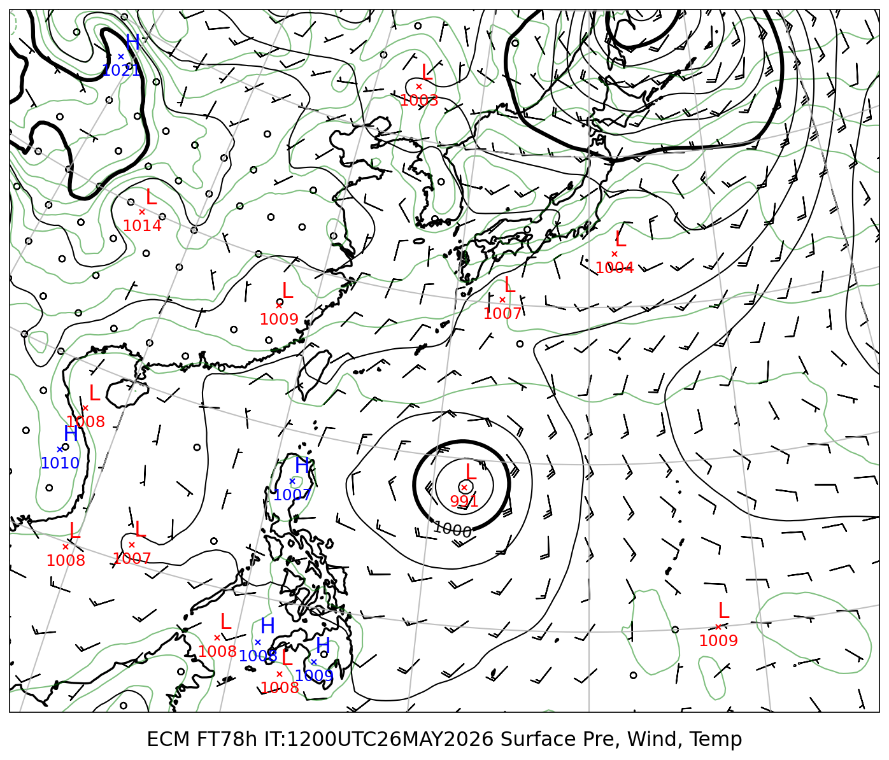

# 地上気圧 GSM/ECMWF 比較レポート

**初期時刻**: 2026/05/26 12UTC

---

## 地上気圧・10m風・2m気温

#### FT=6h (5/27 3時JST)

| GSM | ECMWF |
|:---:|:---:|
|  |  |

#### FT=30h (5/28 3時JST)

| GSM | ECMWF |
|:---:|:---:|
|  |  |

#### FT=54h (5/29 3時JST)

| GSM | ECMWF |
|:---:|:---:|
|  |  |

#### FT=78h (5/30 3時JST)

| GSM | ECMWF |
|:---:|:---:|
|  |  |

#### FT=102h (5/31 3時JST)

| GSM | ECMWF |
|:---:|:---:|
|  |  |

#### FT=126h (6/1 3時JST)

| GSM | ECMWF |
|:---:|:---:|
|  |  |
