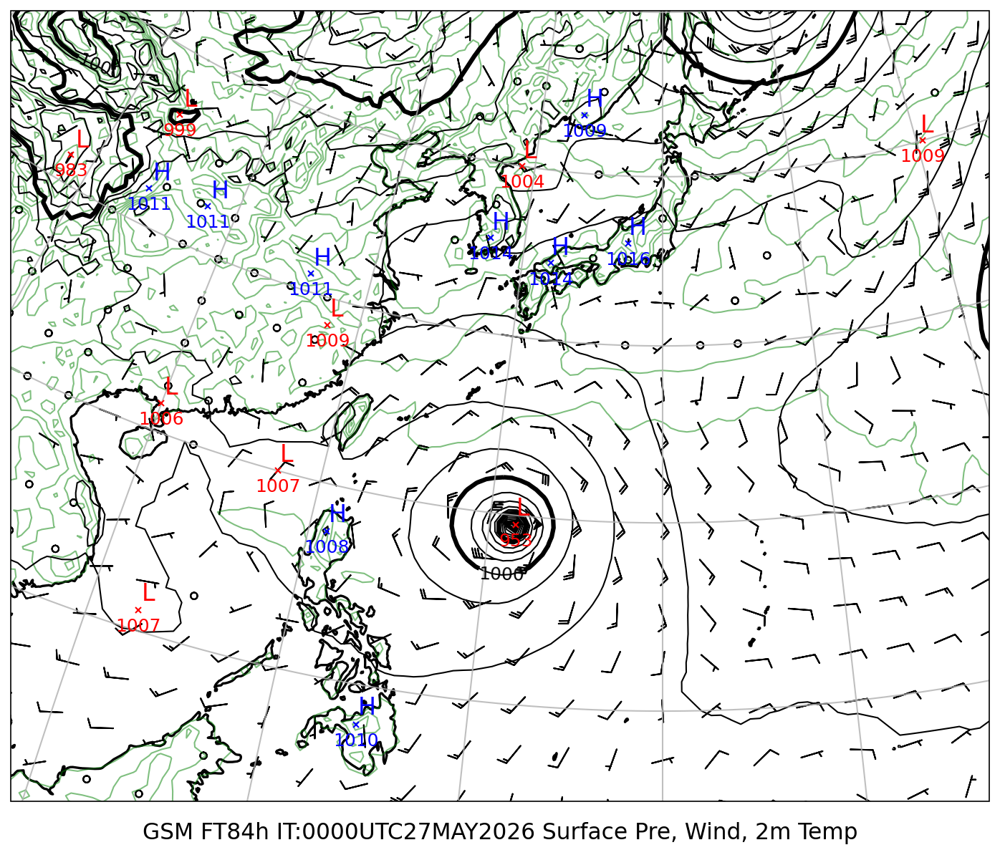
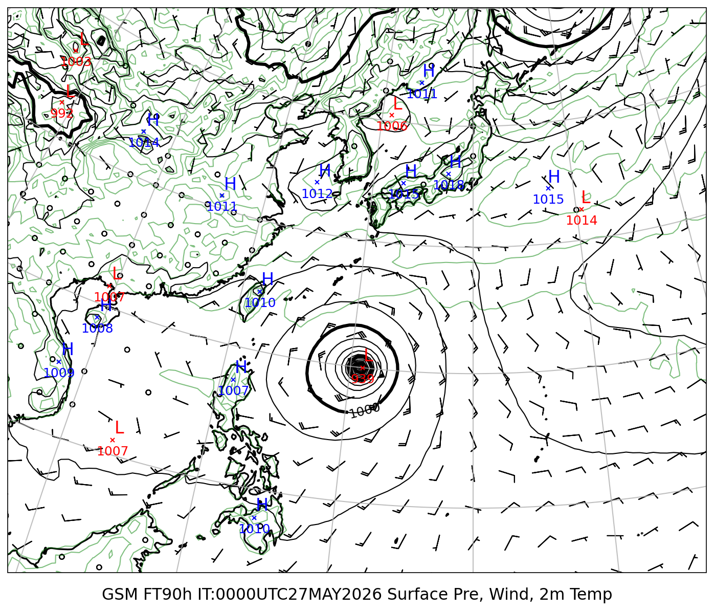
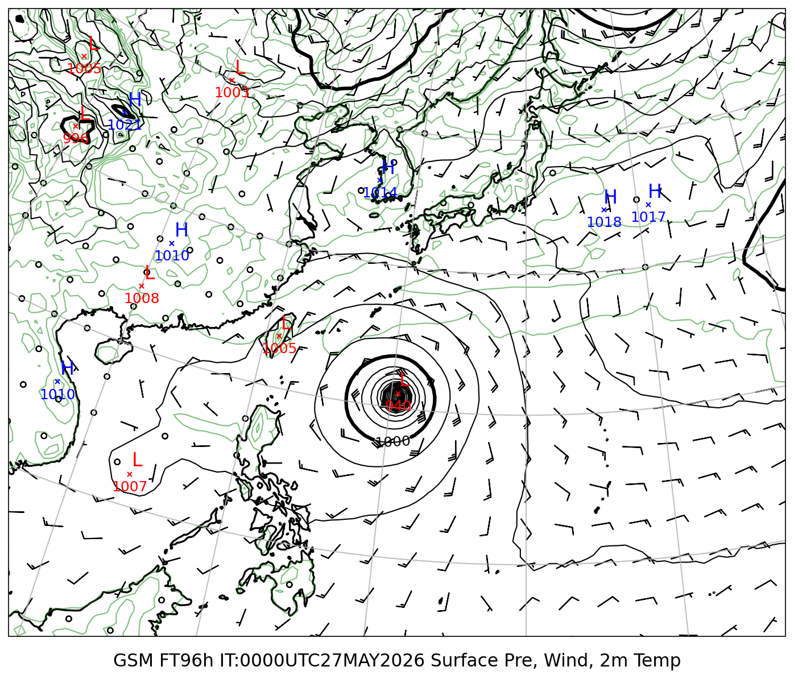
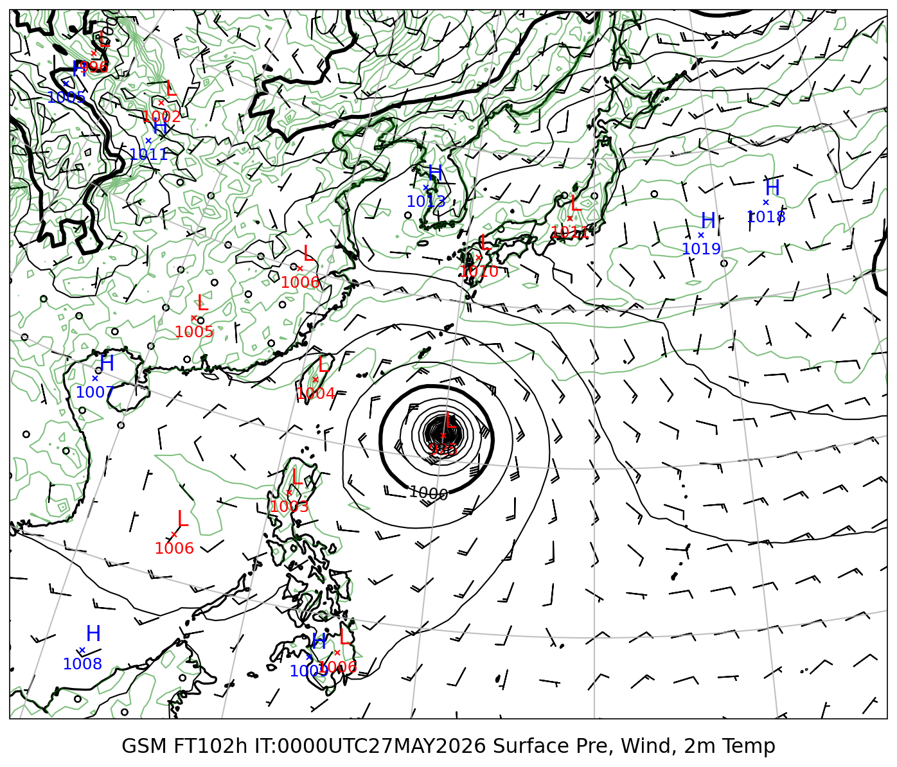
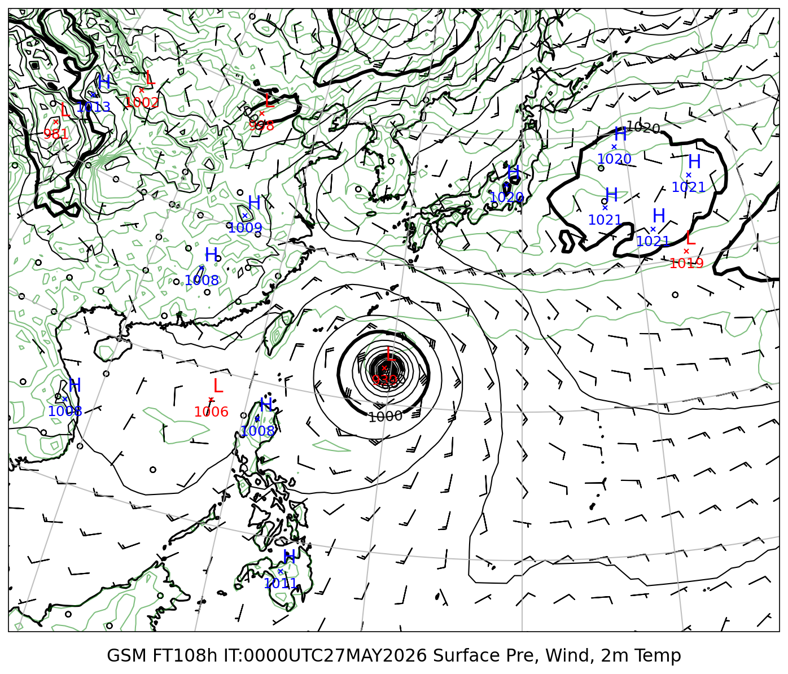
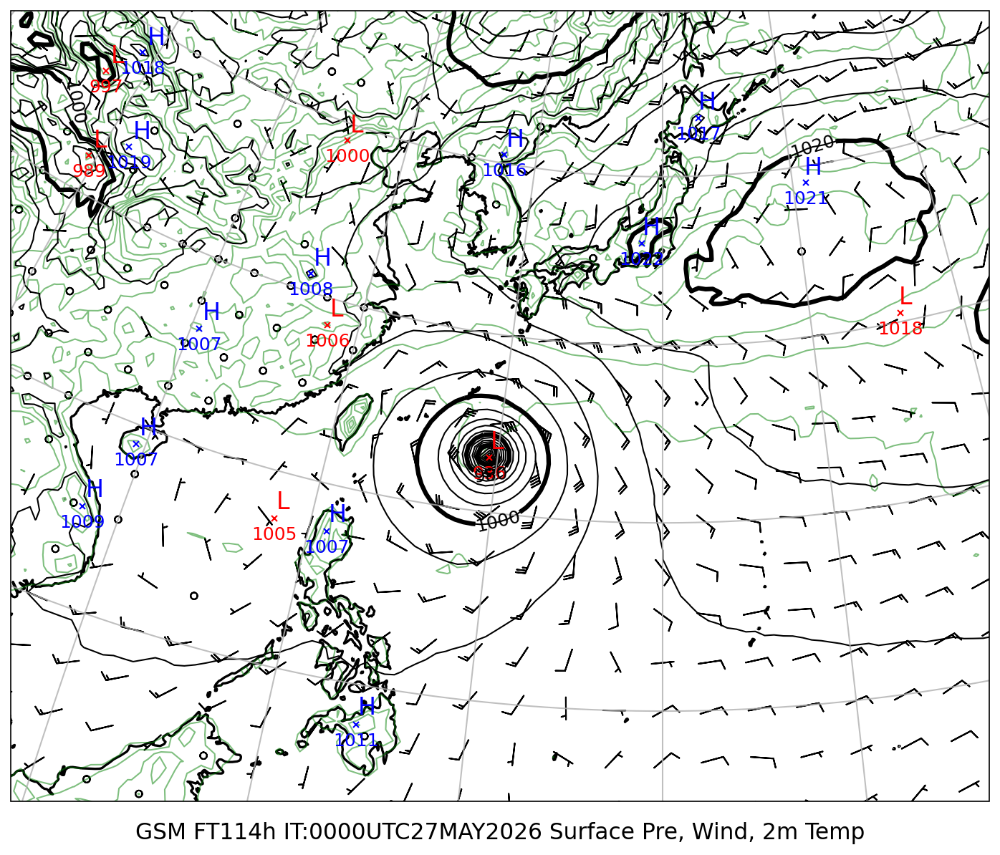

# 地上気圧 GSM/ECMWF 比較レポート

**初期時刻**: 2026/05/27 00UTC

---

## 地上気圧・10m風・2m気温

#### FT=84h (5/30 21時JST)

#### FT=90h (5/31 3時JST)

#### FT=96h (5/31 9時JST)

#### FT=102h (5/31 15時JST)

#### FT=108h (5/31 21時JST)

#### FT=114h (6/1 3時JST)

