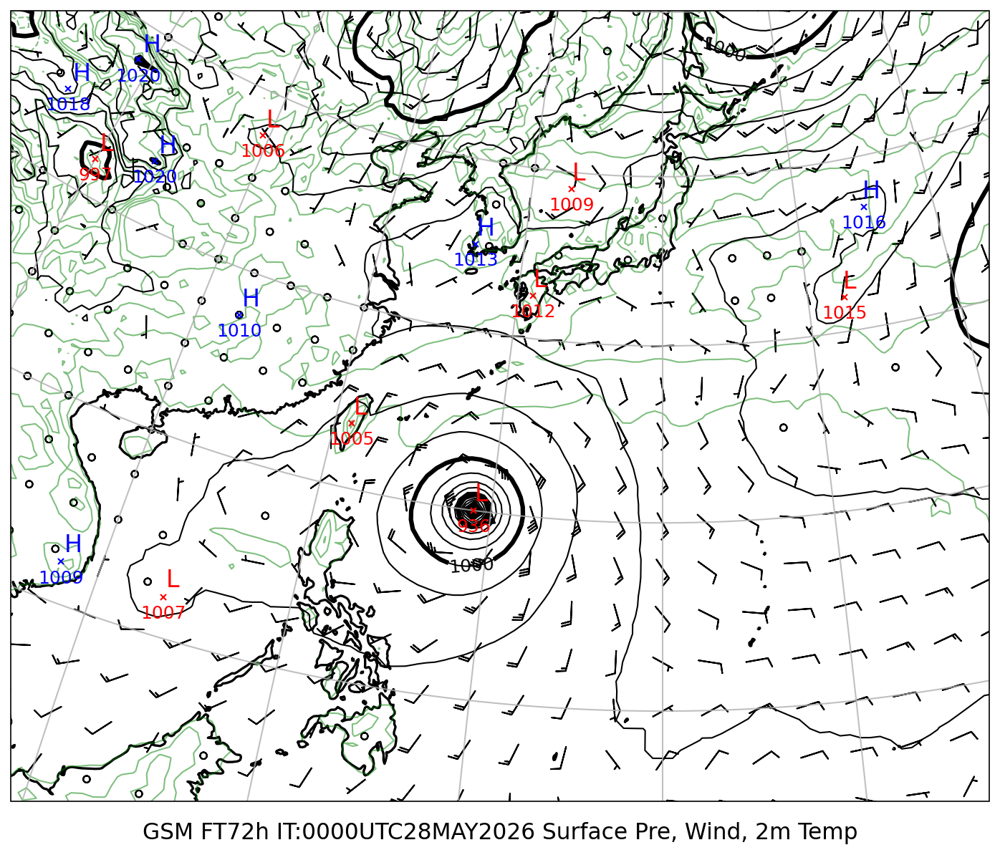
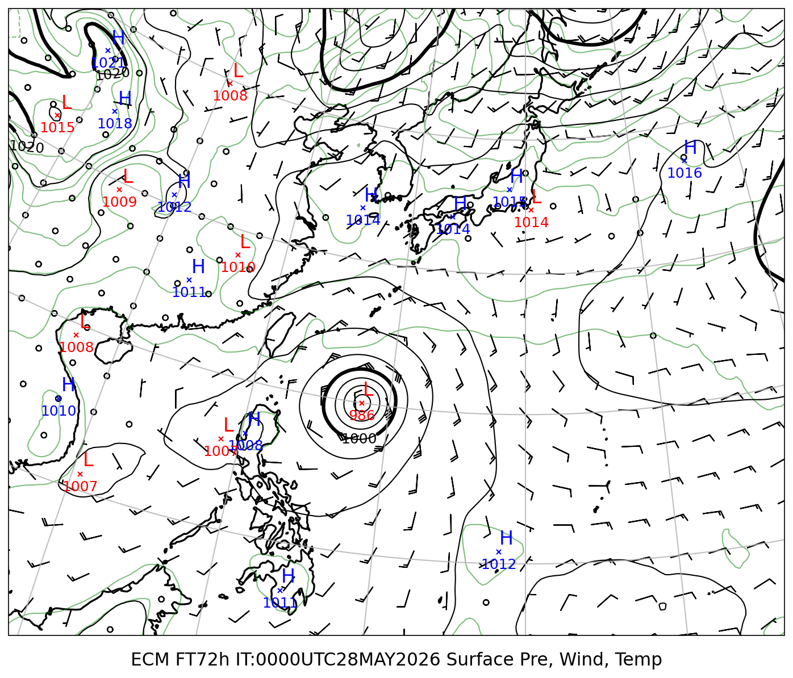
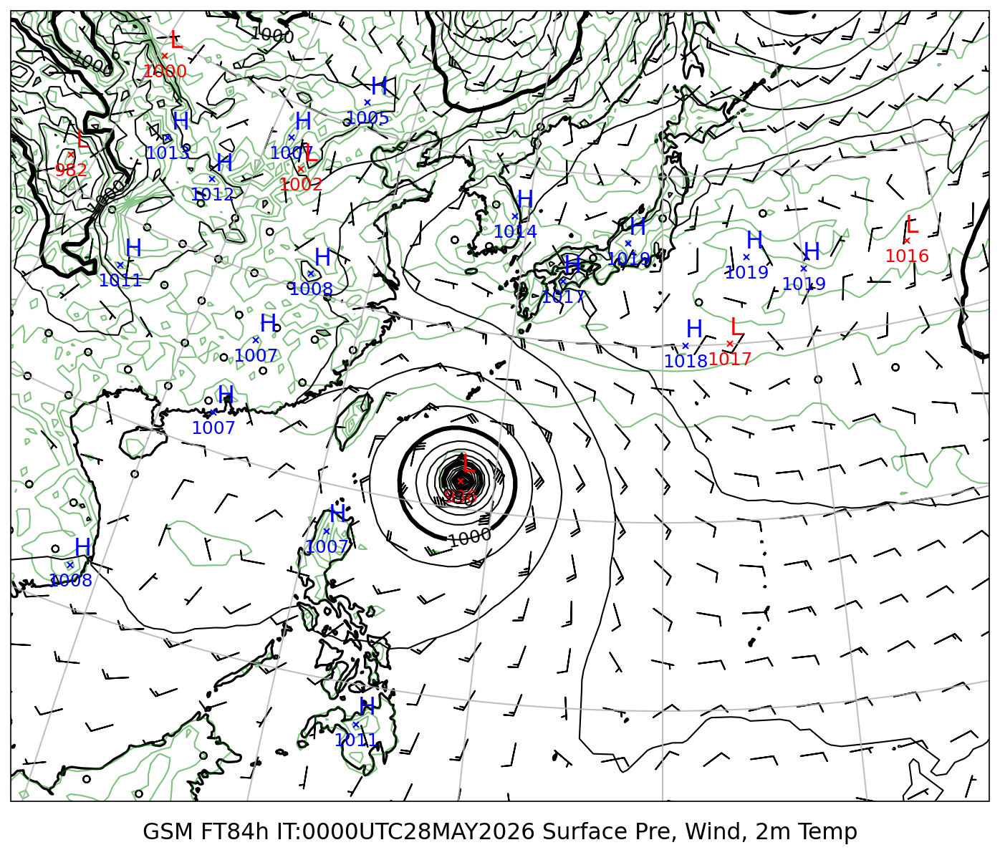
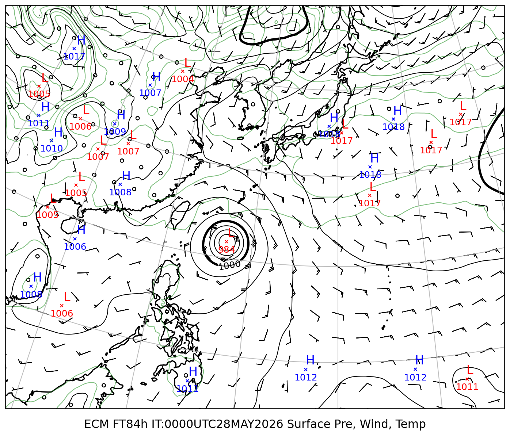
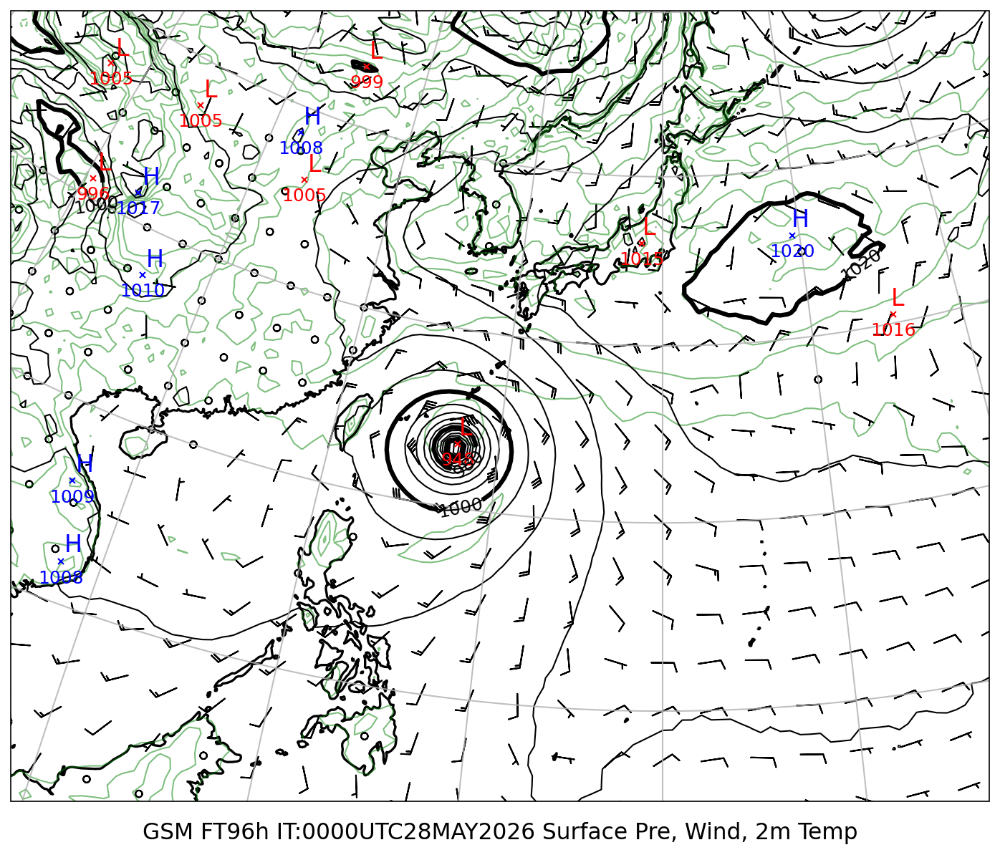
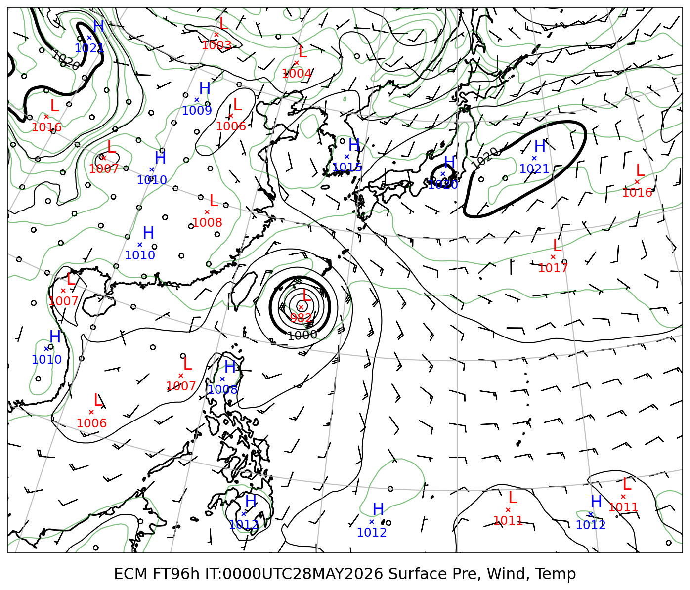
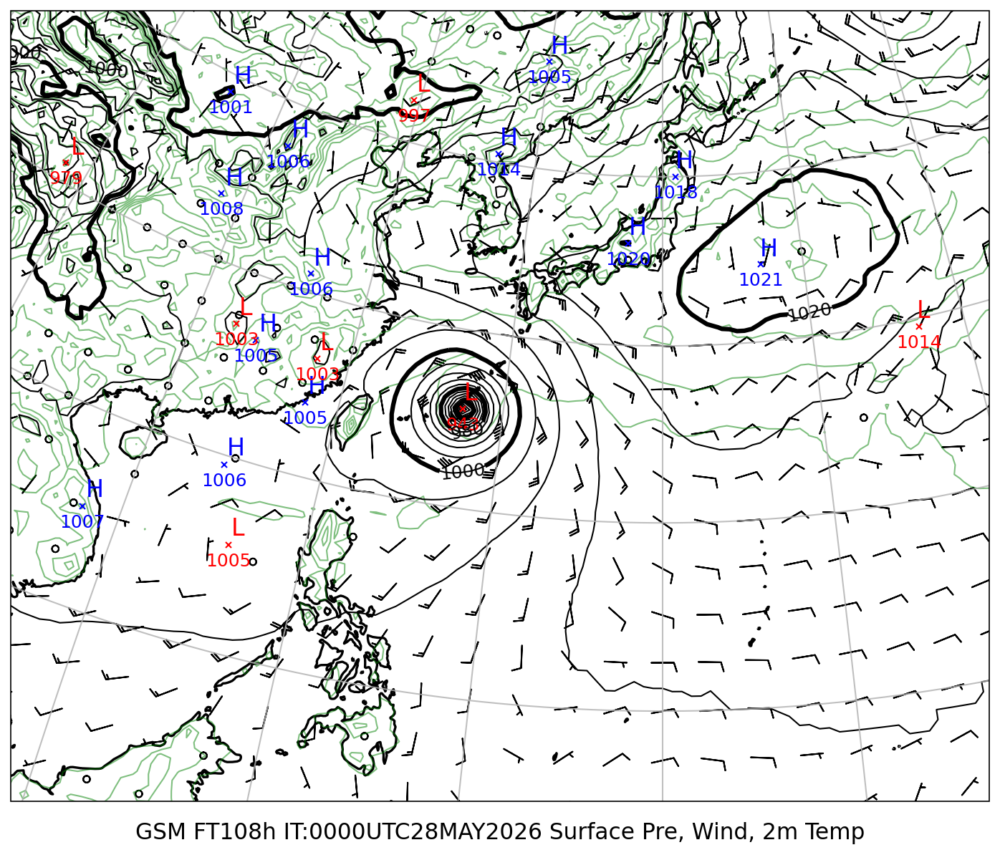
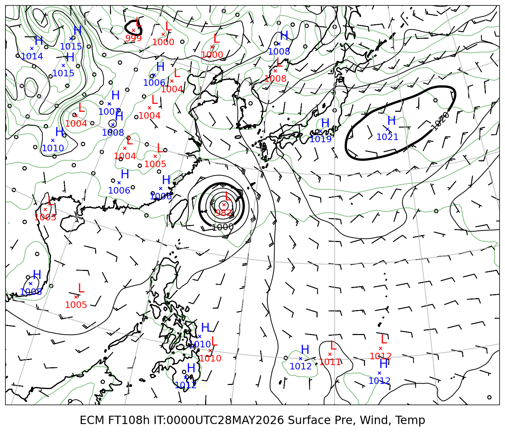
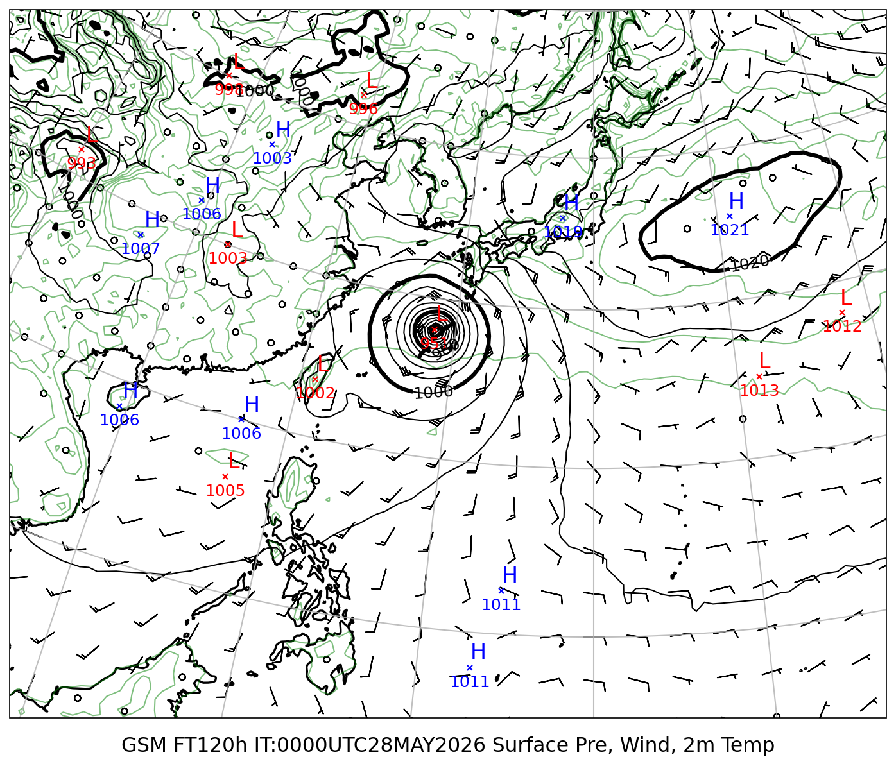
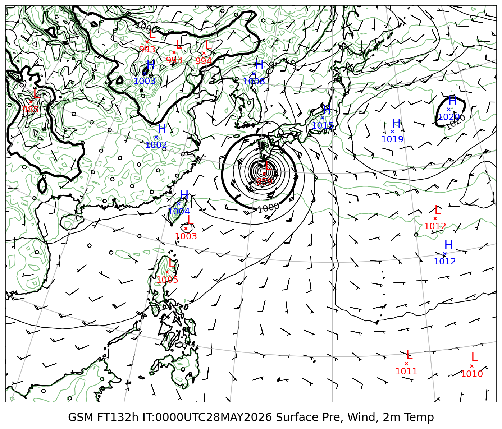

# 地上気圧 GSM/ECMWF 比較レポート

**初期時刻**: 2026/05/28 00UTC

---

## 地上気圧・10m風・2m気温

#### FT=72h (5/31 9時JST)

| GSM | ECMWF |
|:---:|:---:|
|  |  |

#### FT=84h (5/31 21時JST)

| GSM | ECMWF |
|:---:|:---:|
|  |  |

#### FT=96h (6/1 9時JST)

| GSM | ECMWF |
|:---:|:---:|
|  |  |

#### FT=108h (6/1 21時JST)

| GSM | ECMWF |
|:---:|:---:|
|  |  |

#### FT=120h (6/2 9時JST)

#### FT=132h (6/2 21時JST)

