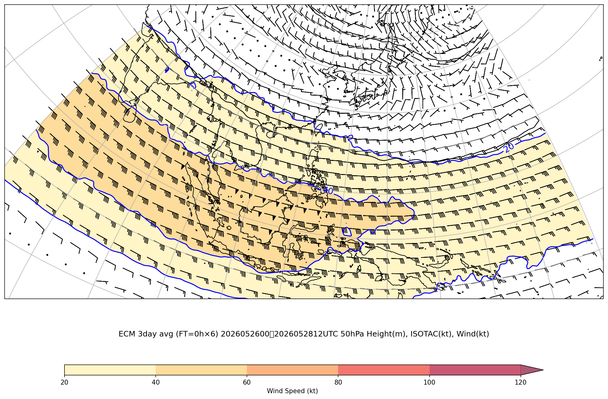
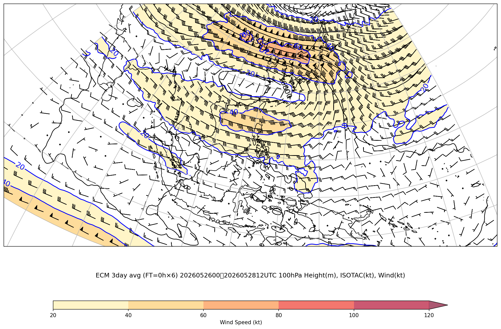
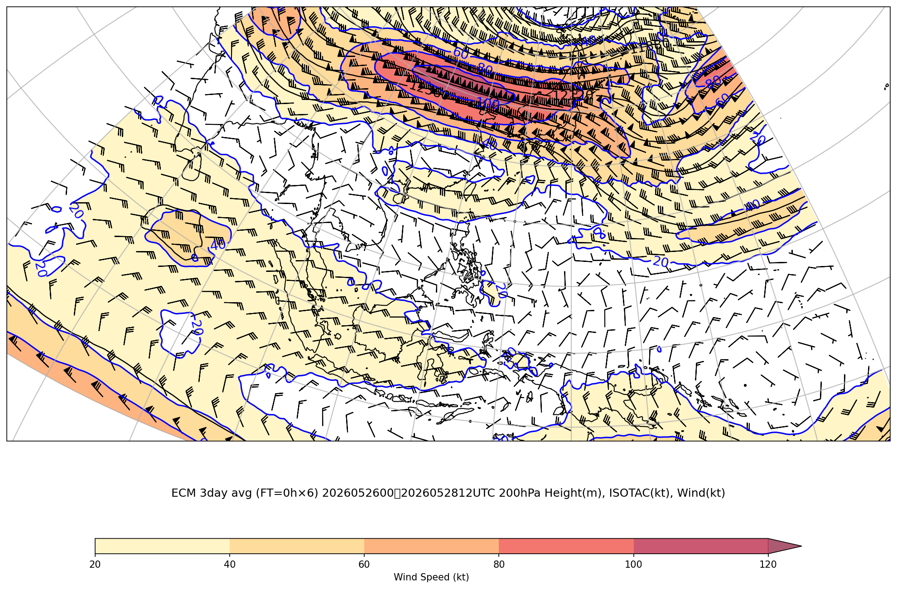
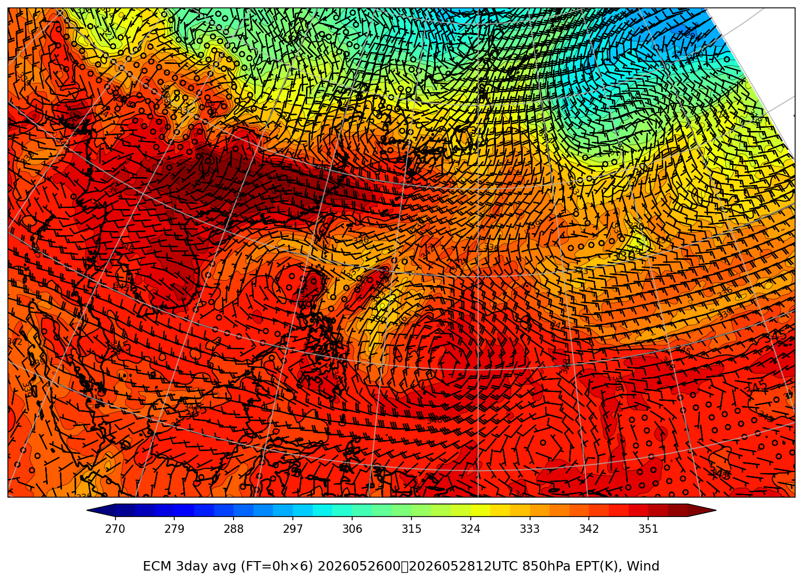

# ジェット・前線解析（広域・時間平均）

**最新初期時刻**: 2026/05/28 12UTC  （3日間 / 6個 平均）
**平均期間**: 2026/05/26 00UTC 〜 2026/05/28 12UTC

*(描画領域: 上層 lonW=70 lonE=180 latS=-12 latN=30、850hPa lonW=97 lonE=169 latS=-2.5 latN=42.5)*

---

## 上層風（50hPa+100hPa+200hPa）

### ECMWF 50hPa (3日平均)

### ECMWF 100hPa (3日平均)

### ECMWF 200hPa (3日平均)

---

## 850hPa 相当温位・風矢羽

### ECMWF (3日平均)

---
