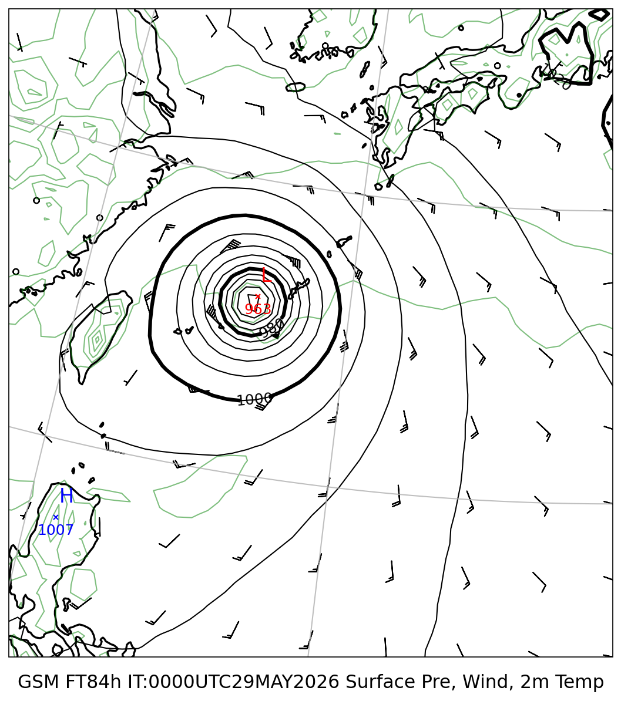
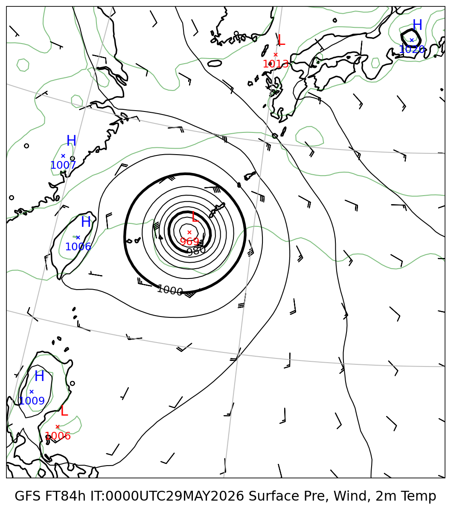
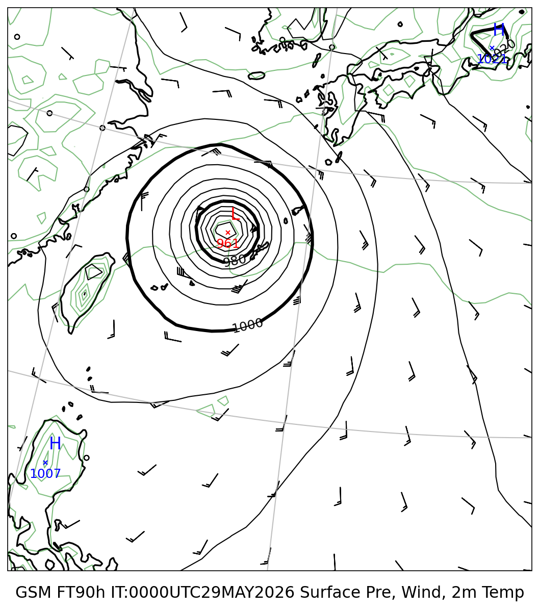
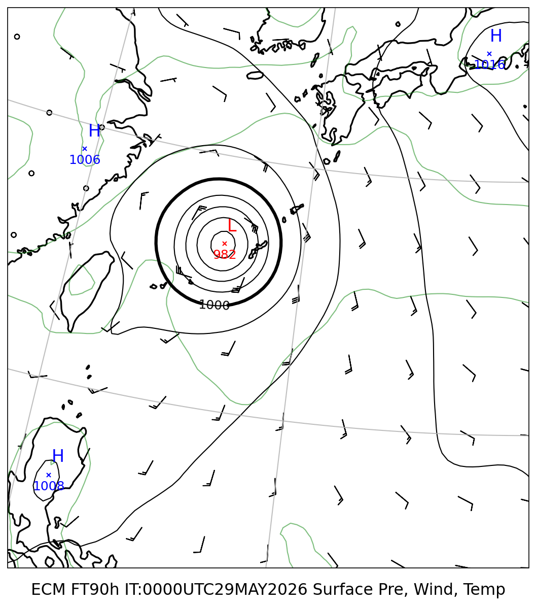
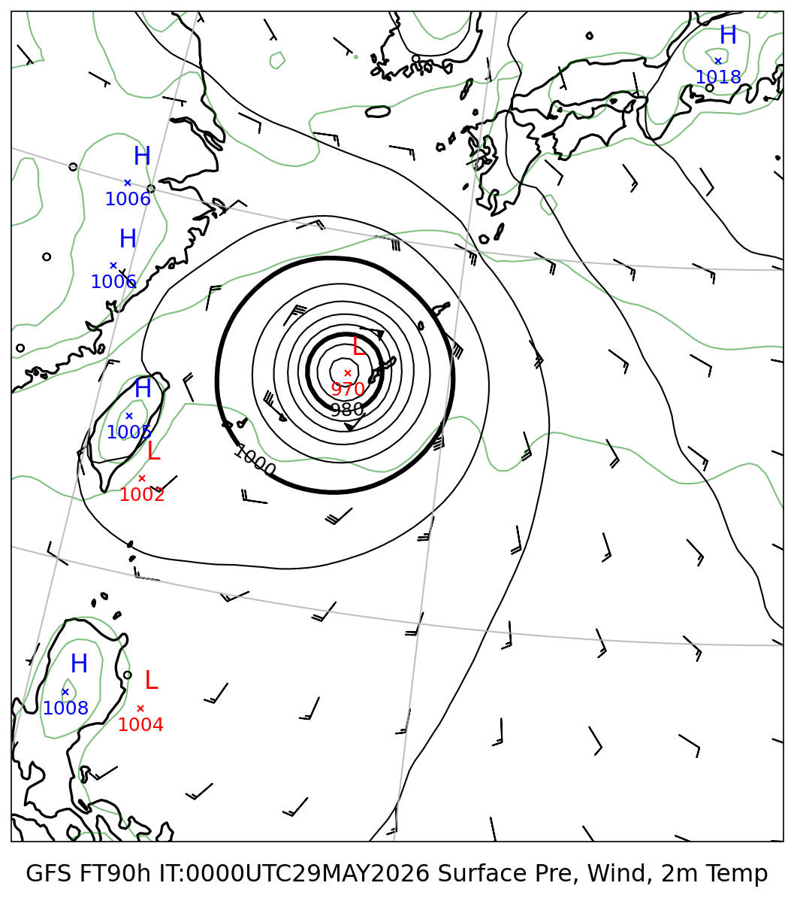

# 地上気圧 マルチモデル比較レポート

**初期時刻**: 2026/05/29 00UTC
**描画範囲**: LON 120.0〜140.0°E  LAT 15.0〜35.0°N

---

## 地上気圧・10m風・2m気温

#### FT=84h (6/1 21時JST)

| GSM | GFS |
|:---:|:---:|
|  |  |

#### FT=90h (6/2 3時JST)

| GSM | ECMWF | GFS |
|:---:|:---:|:---:|
|  |  |  |
