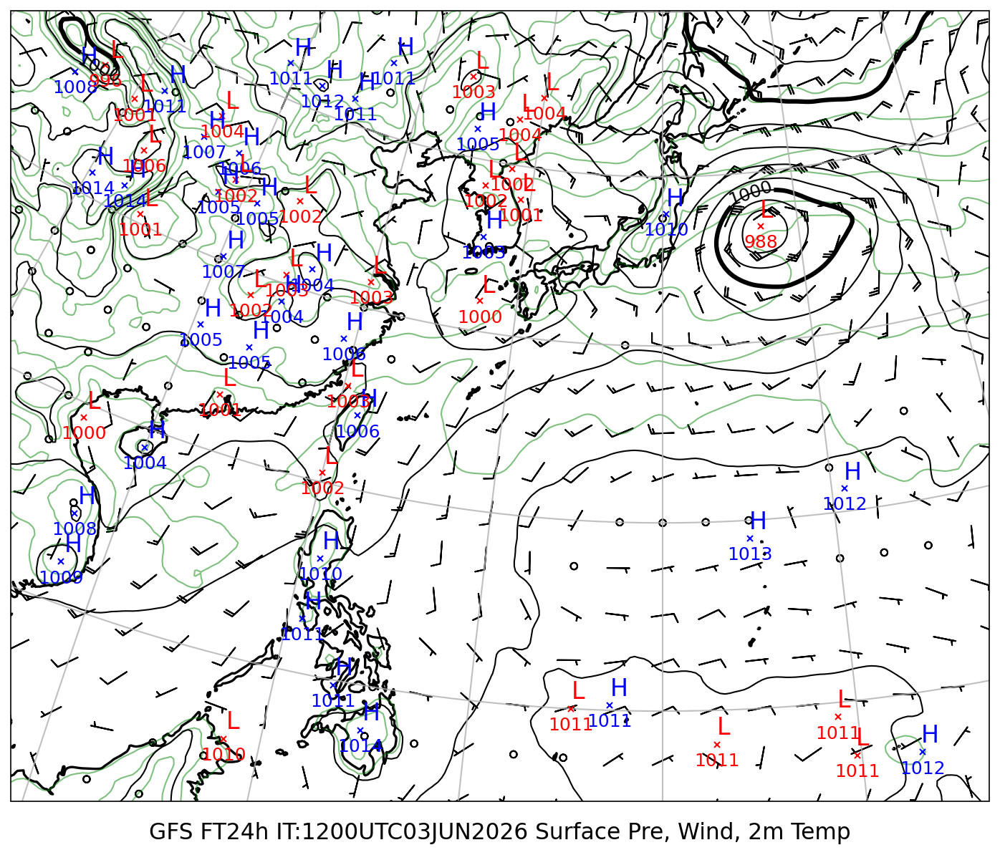
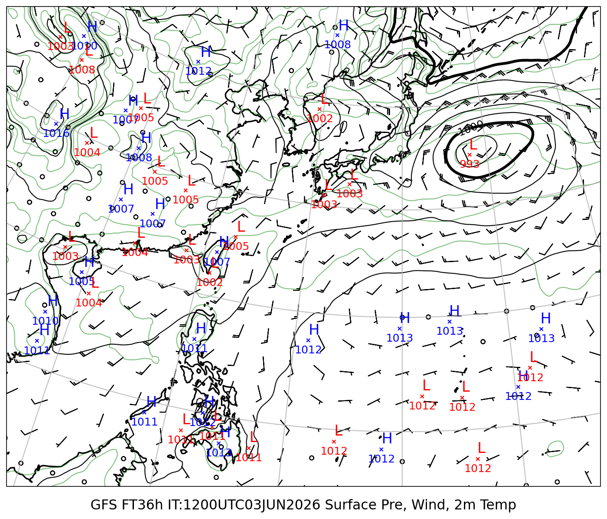
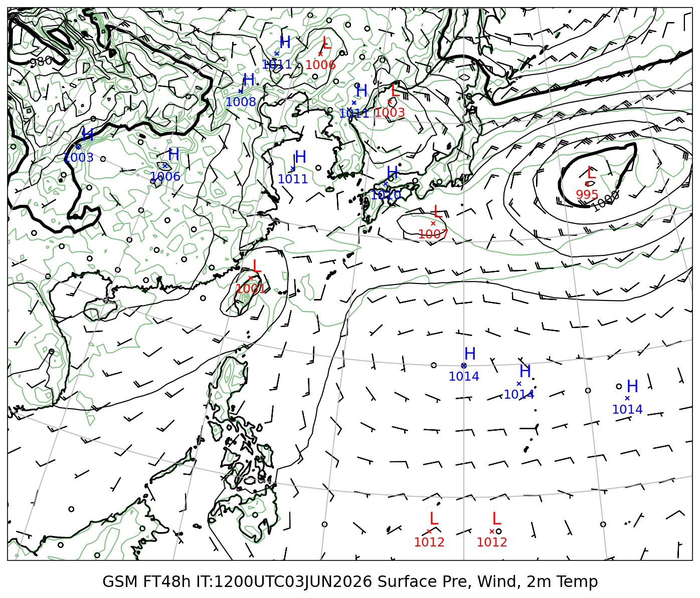
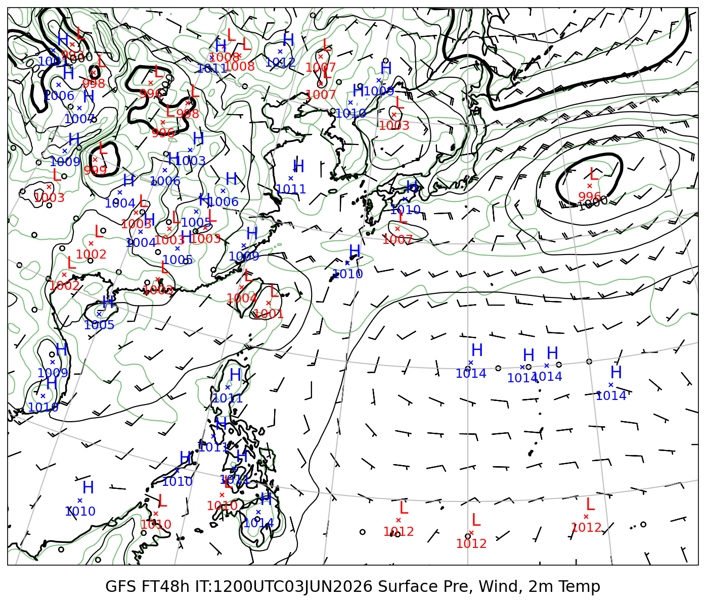

# 地上気圧 マルチモデル比較レポート

**初期時刻**: 2026/06/03 12UTC
**描画範囲**: LON 108〜156°E  LAT 5〜45°N

---

## 地上気圧・10m風・2m気温

#### FT=24h (6/4 21時JST)

#### FT=36h (6/5 9時JST)

#### FT=48h (6/5 21時JST)

| GSM | GFS |
|:---:|:---:|
|  |  |
