# 地上気圧 マルチモデル比較レポート

**初期時刻**: 2026/06/04 12UTC
**描画範囲**: LON 110.0〜140.0°E  LAT 15.0〜35.0°N

---

## 地上気圧・10m風・2m気温

#### FT=24h (6/5 21時JST)

| GSM | GFS |
|:---:|:---:|
| 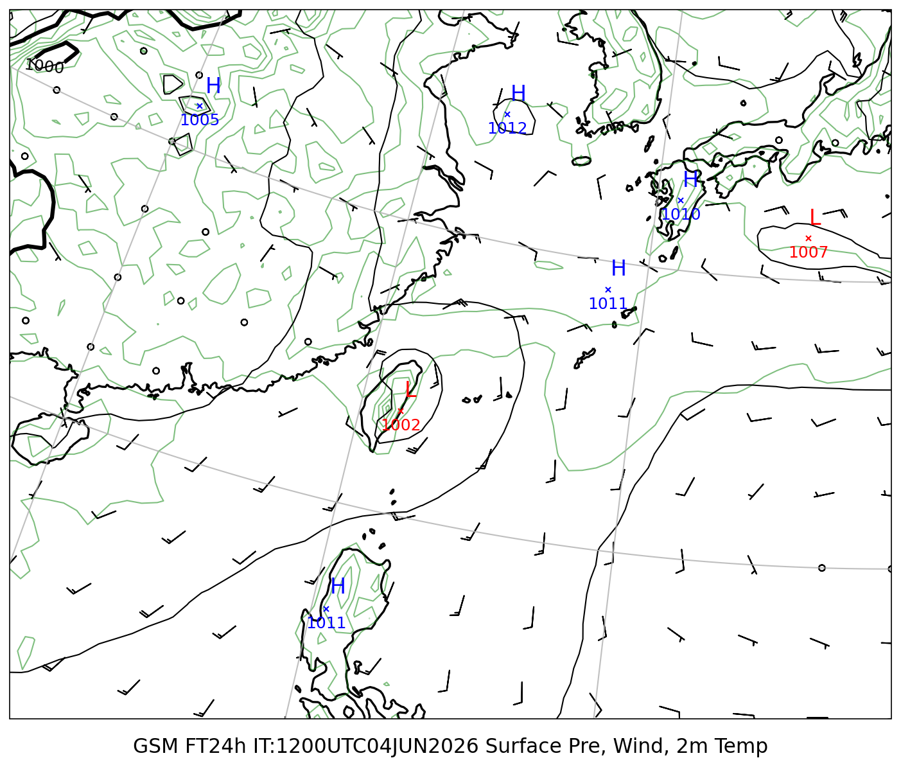 | 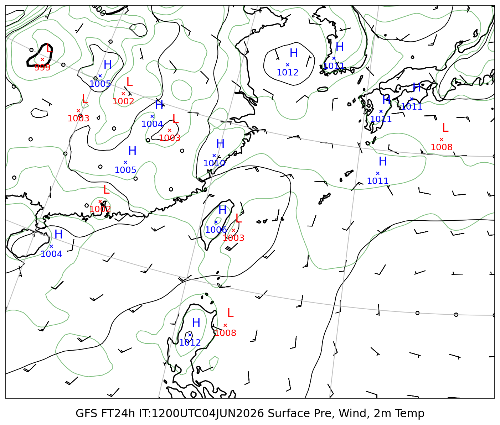 |

#### FT=30h (6/6 3時JST)

| GSM | GFS |
|:---:|:---:|
| 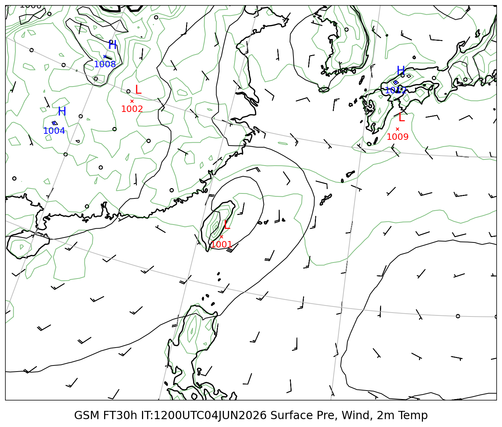 | 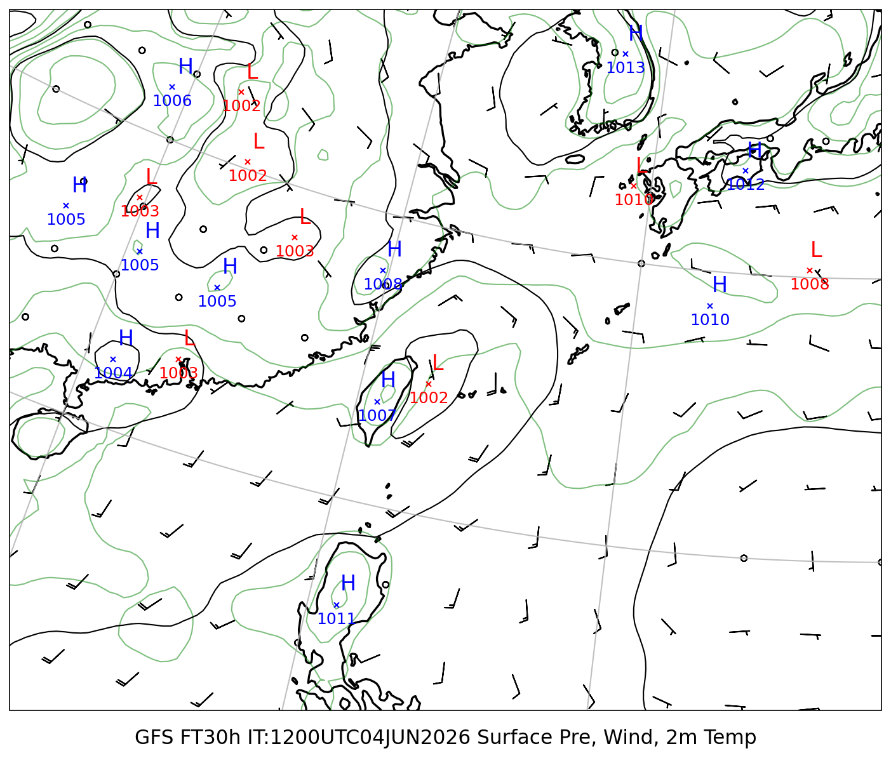 |

#### FT=36h (6/6 9時JST)

| GSM | GFS |
|:---:|:---:|
| 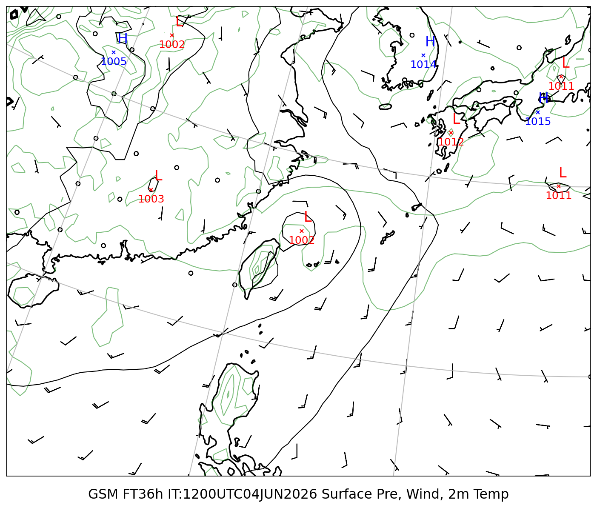 | 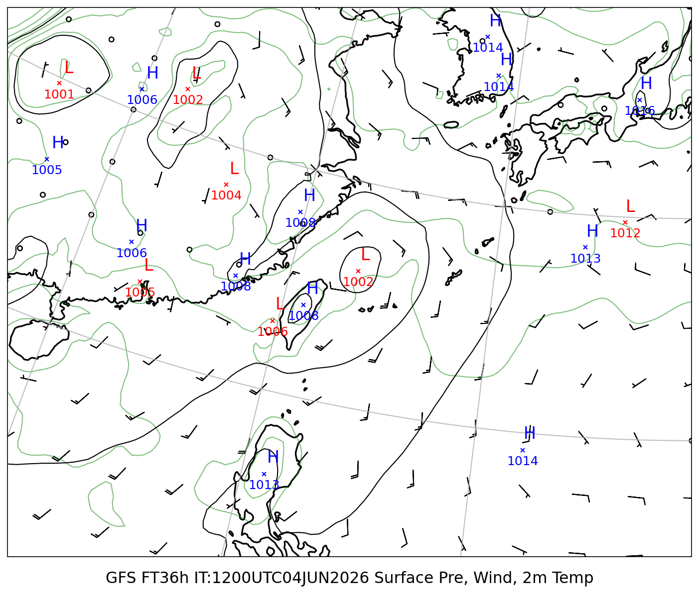 |

#### FT=42h (6/6 15時JST)

| GSM | GFS |
|:---:|:---:|
| 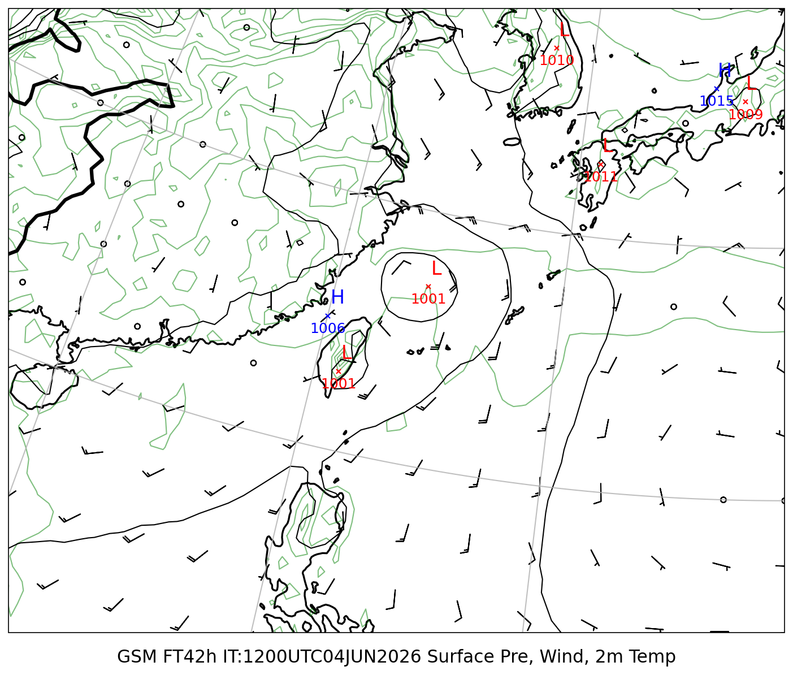 | 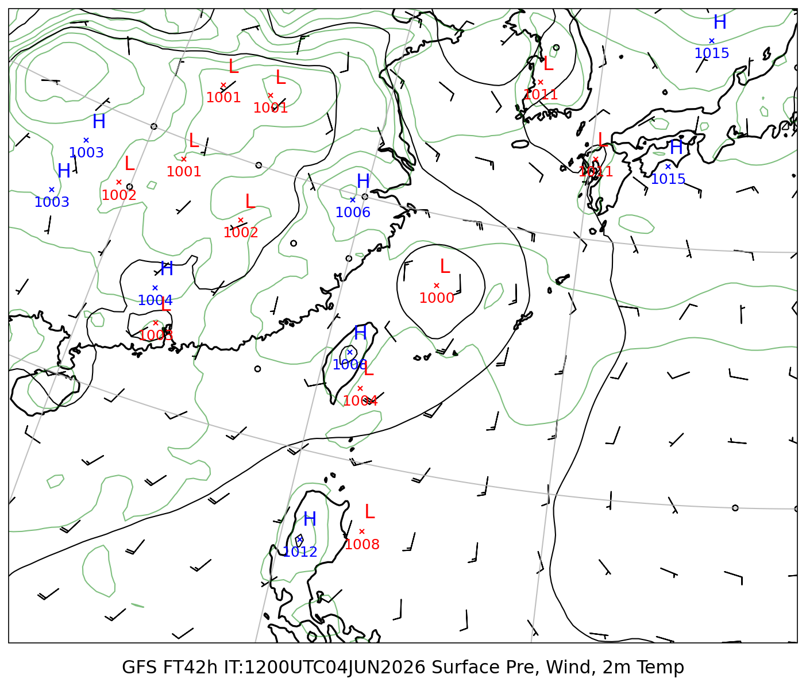 |

#### FT=48h (6/6 21時JST)

| GSM | GFS |
|:---:|:---:|
| 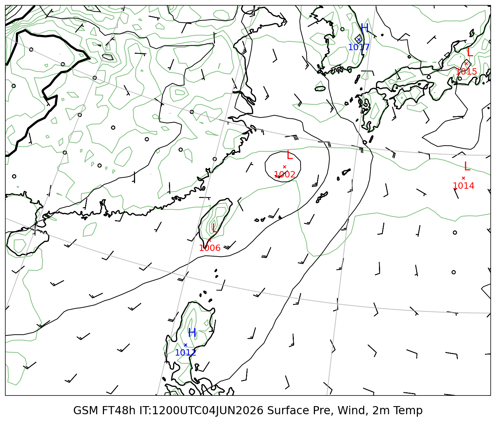 | 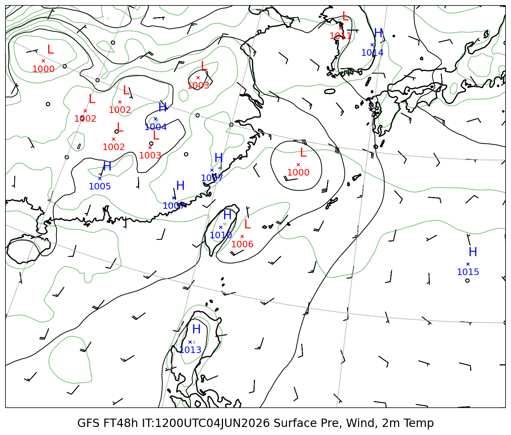 |

#### FT=54h (6/7 3時JST)

| GSM | GFS |
|:---:|:---:|
| 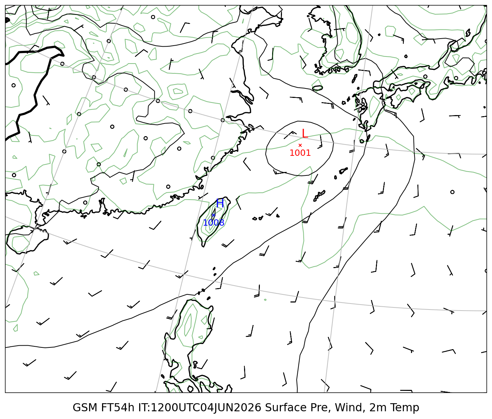 | 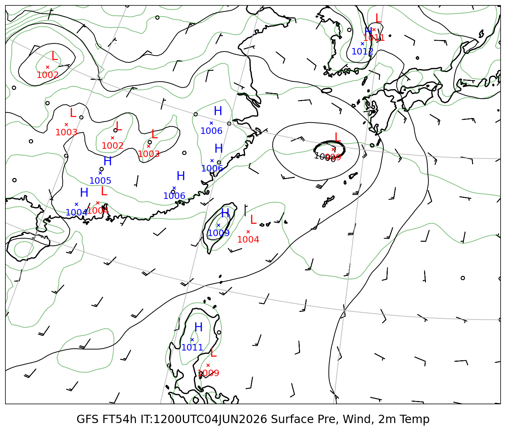 |
