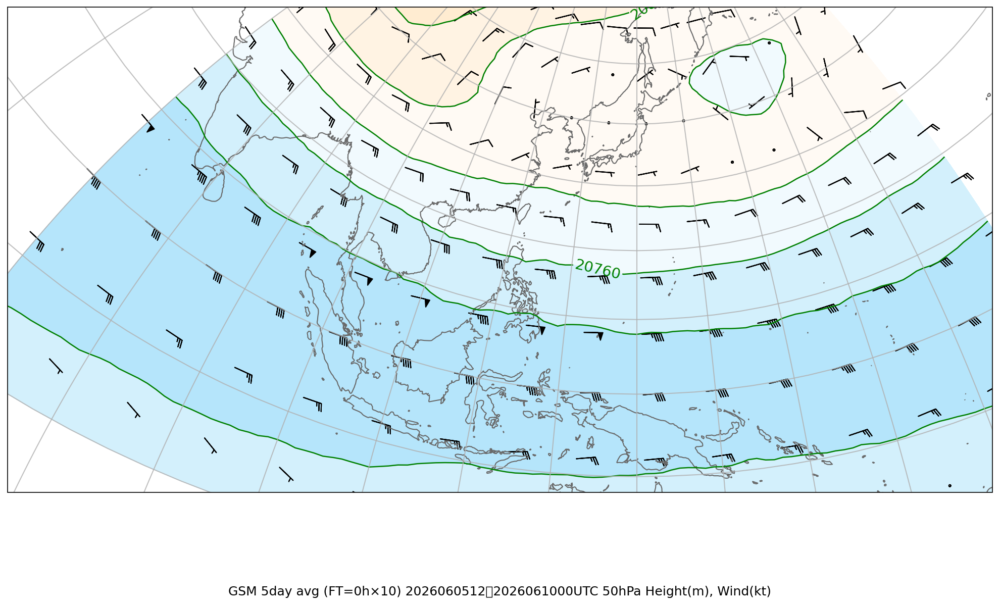
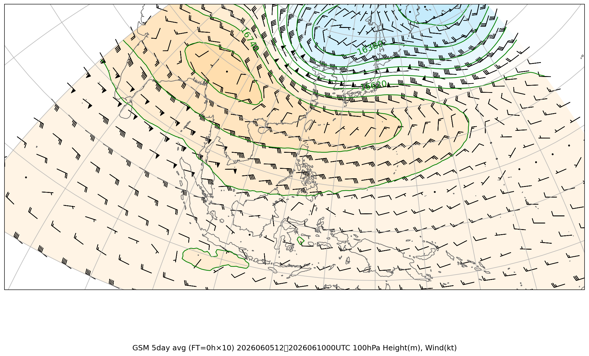
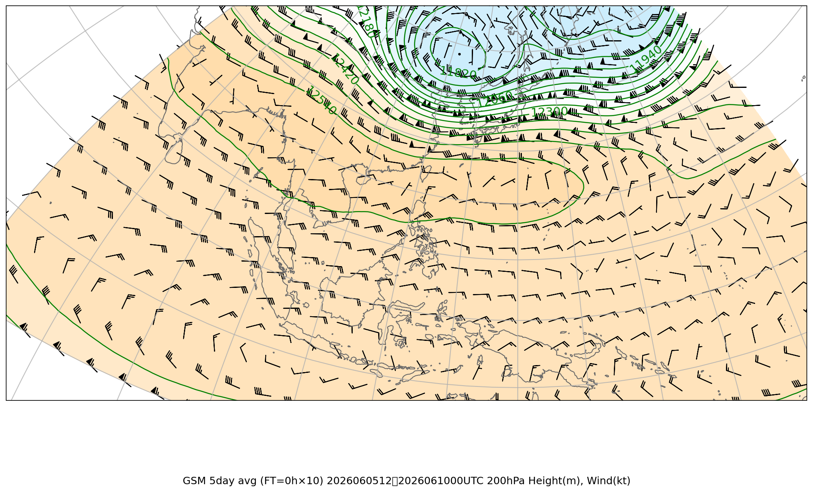
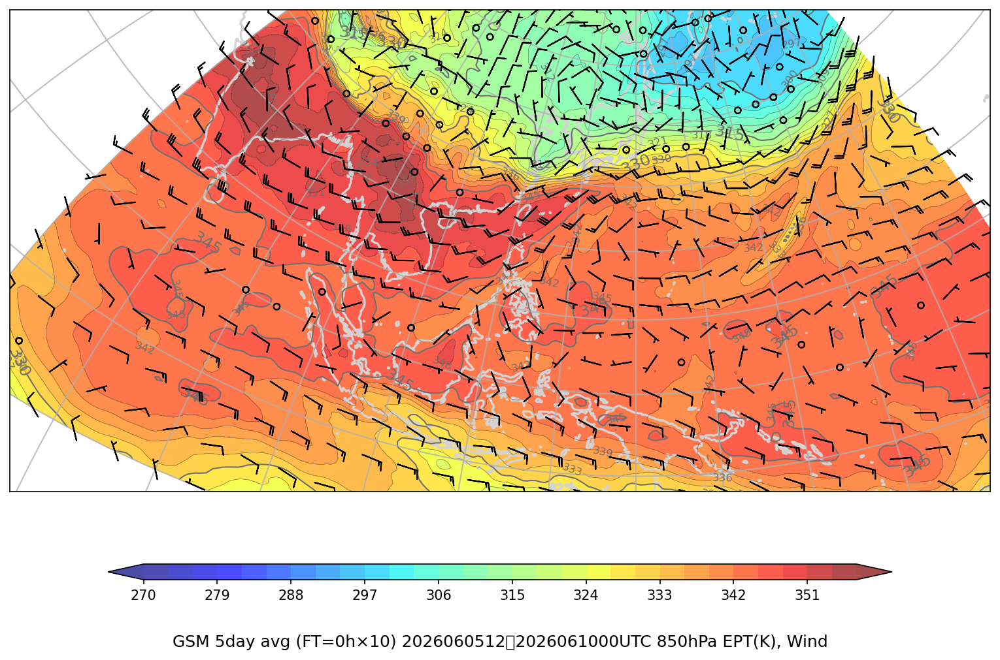

# ジェット・前線解析（広域・時間平均）

**最新初期時刻**: 2026/06/10 00UTC  （5日間 / 10個 平均）
**平均期間**: 2026/06/05 12UTC 〜 2026/06/10 00UTC

*(描画領域: 上層 lonW=70 lonE=180 latS=-12 latN=30、850hPa lonW=70 lonE=180 latS=-12 latN=30)*

---

## 上層風（50hPa+100hPa+200hPa）

### GSM 50hPa (5日平均)

### GSM 100hPa (5日平均)

### GSM 200hPa (5日平均)

---

## 850hPa 相当温位・風矢羽

### GSM (5日平均)

---
