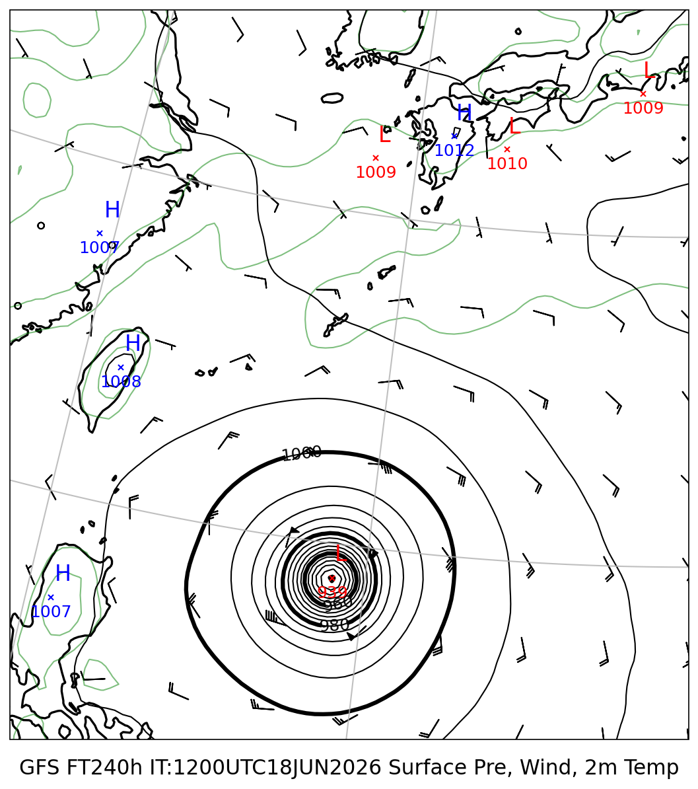
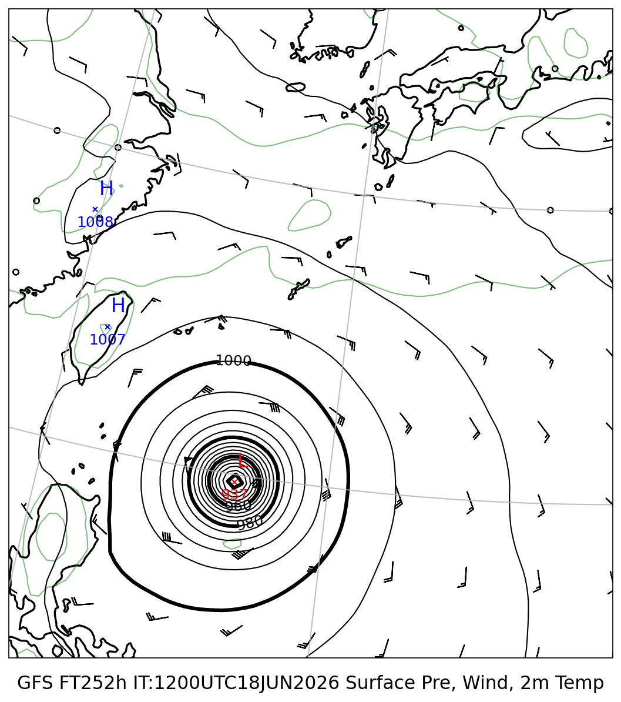
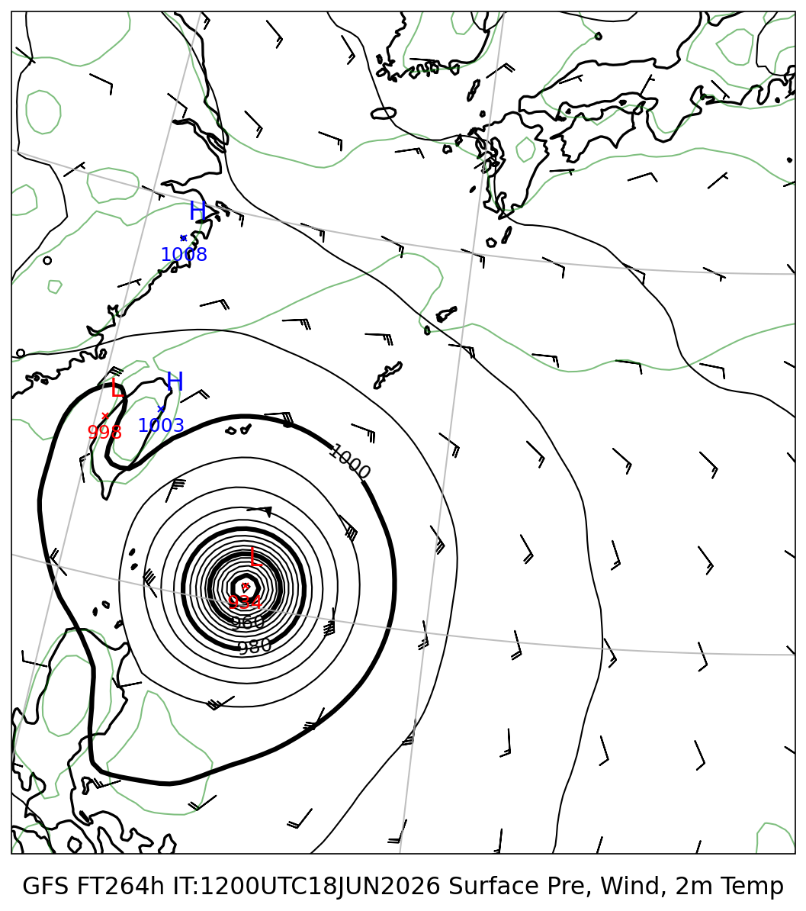
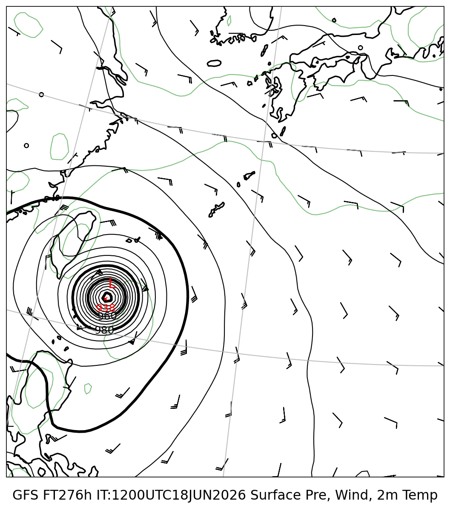
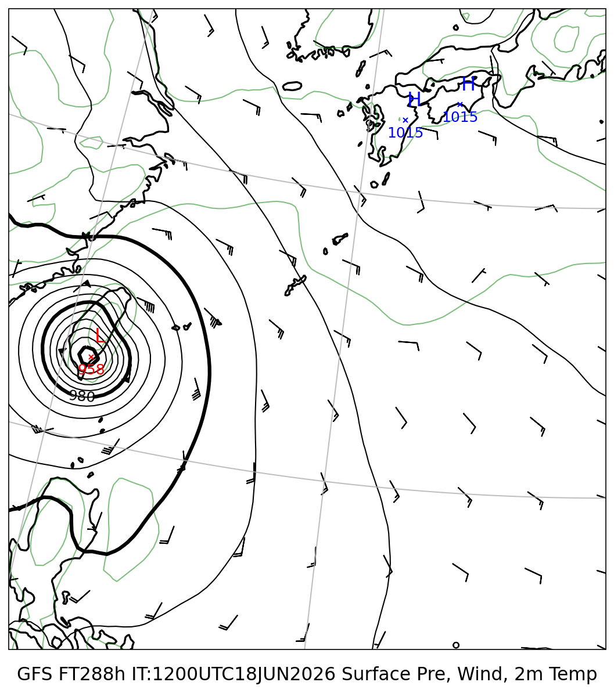
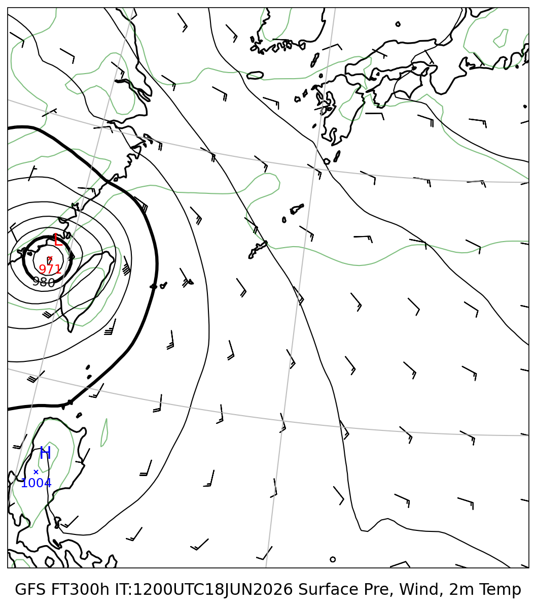

# 地上気圧 マルチモデル比較レポート

**初期時刻**: 2026/06/18 12UTC
**描画範囲**: LON 120.0〜140.0°E  LAT 15.0〜35.0°N

---

## 地上気圧・10m風・2m気温

#### FT=240h (6/28 21時JST)

#### FT=252h (6/29 9時JST)

#### FT=264h (6/29 21時JST)

#### FT=276h (6/30 9時JST)

#### FT=288h (6/30 21時JST)

#### FT=300h (7/1 9時JST)

