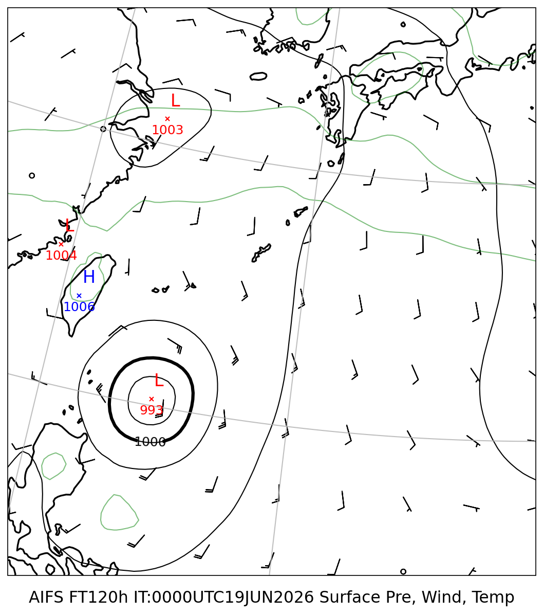
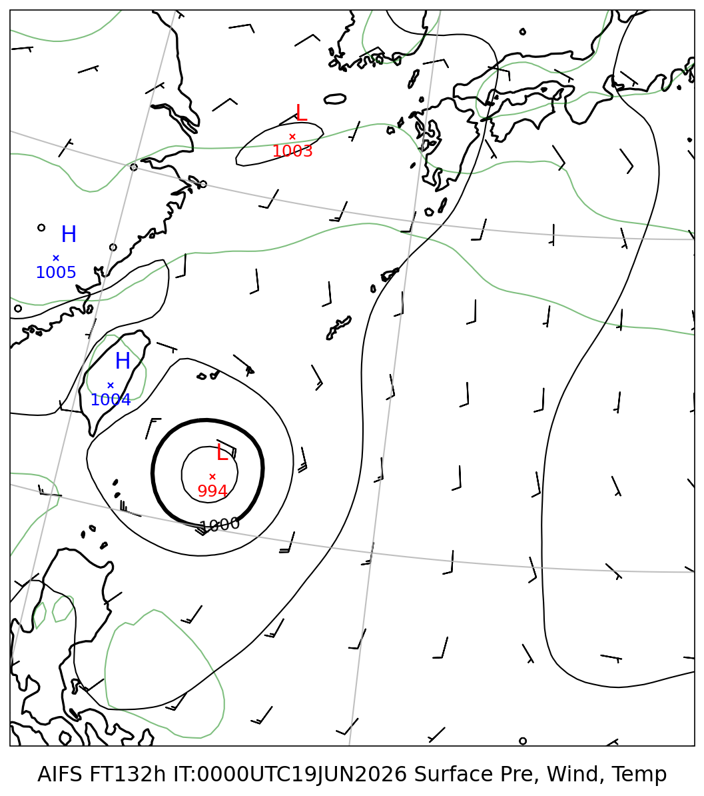
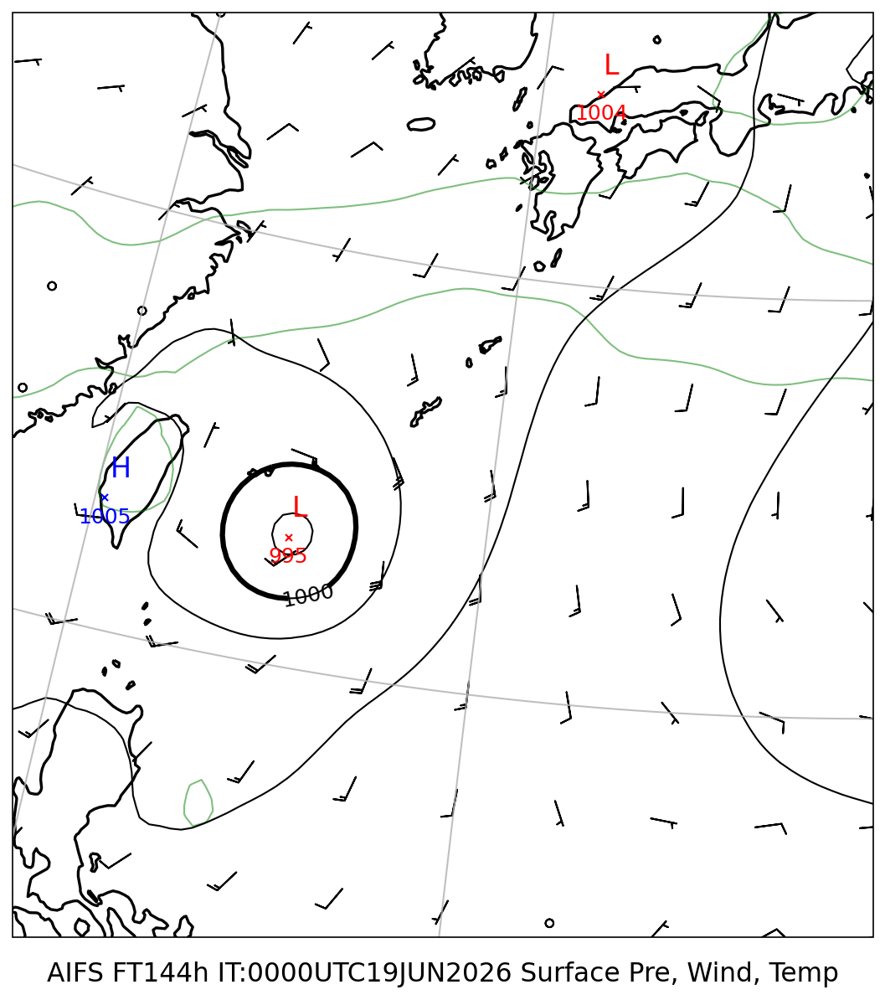
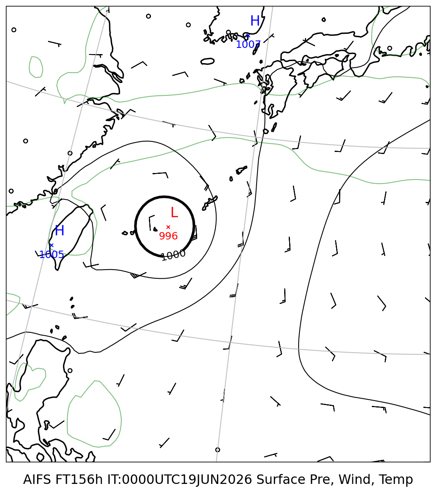
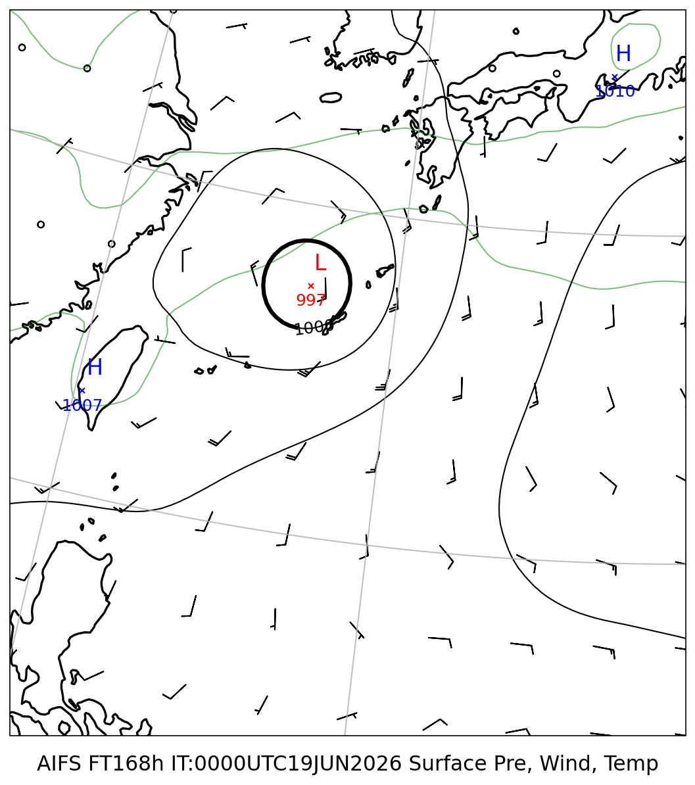
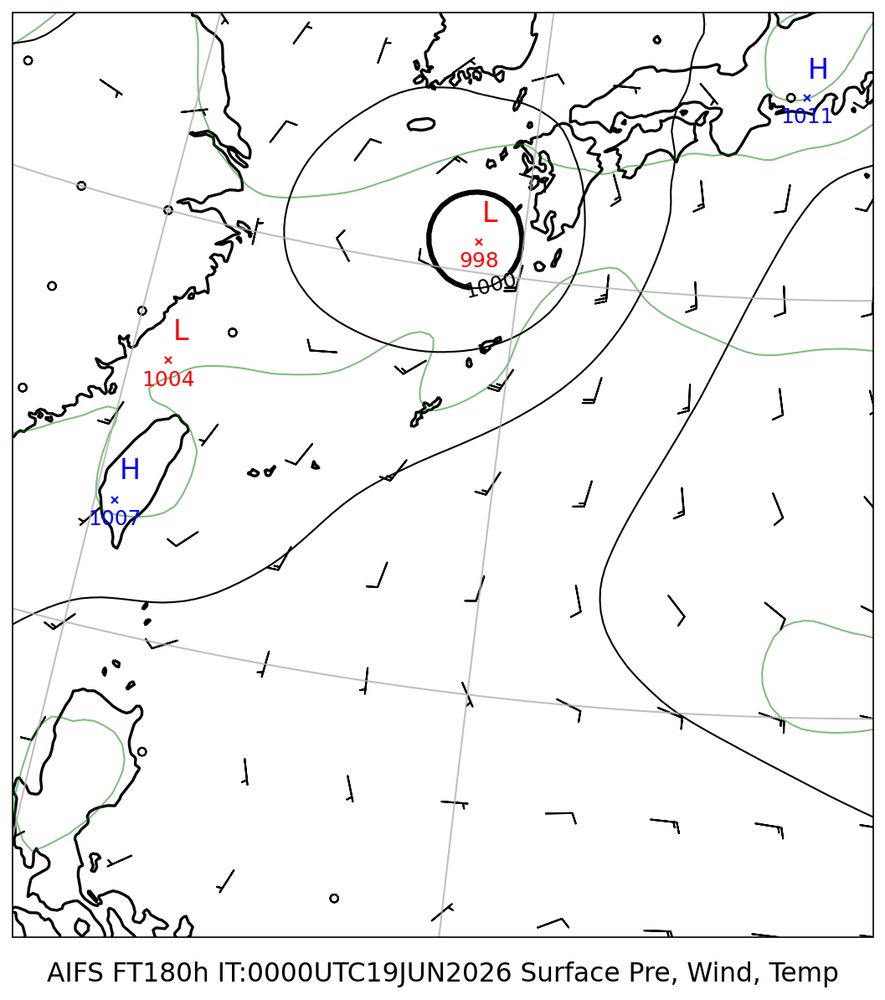

# 地上気圧 マルチモデル比較レポート

**初期時刻**: 2026/06/19 00UTC
**描画範囲**: LON 120.0〜140.0°E  LAT 15.0〜35.0°N

---

## 地上気圧・10m風・2m気温

#### FT=120h (6/24 9時JST)

#### FT=132h (6/24 21時JST)

#### FT=144h (6/25 9時JST)

#### FT=156h (6/25 21時JST)

#### FT=168h (6/26 9時JST)

#### FT=180h (6/26 21時JST)

