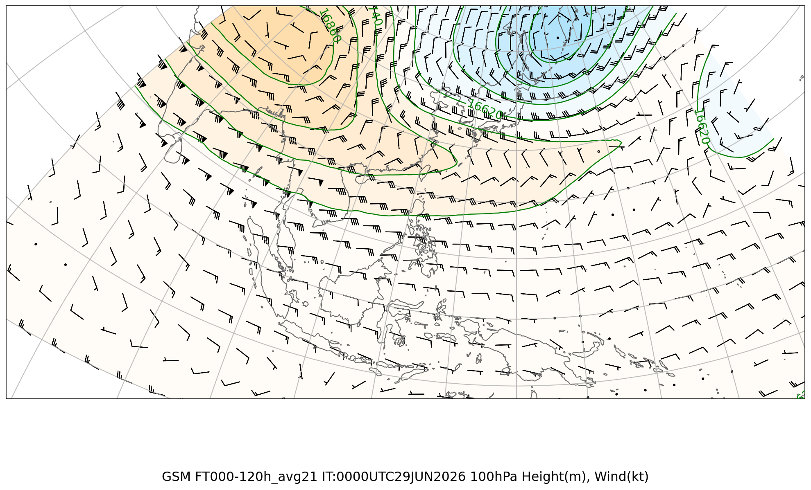
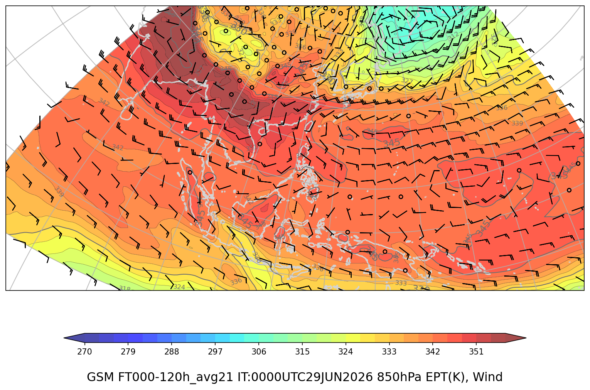

# ジェット・前線解析（広域）

**初期時刻**: 2026/06/29 00UTC

*(描画領域: 上層 lonW=70 lonE=180 latS=-12 latN=30、850hPa lonW=70 lonE=180 latS=-12 latN=30)*

---

## 上層風（100hPa）

### GSM 100hPa

#### FT=000-120h (avg21)

---

## 850hPa 相当温位・風矢羽

### GSM

#### FT=000-120h (avg21)

---
