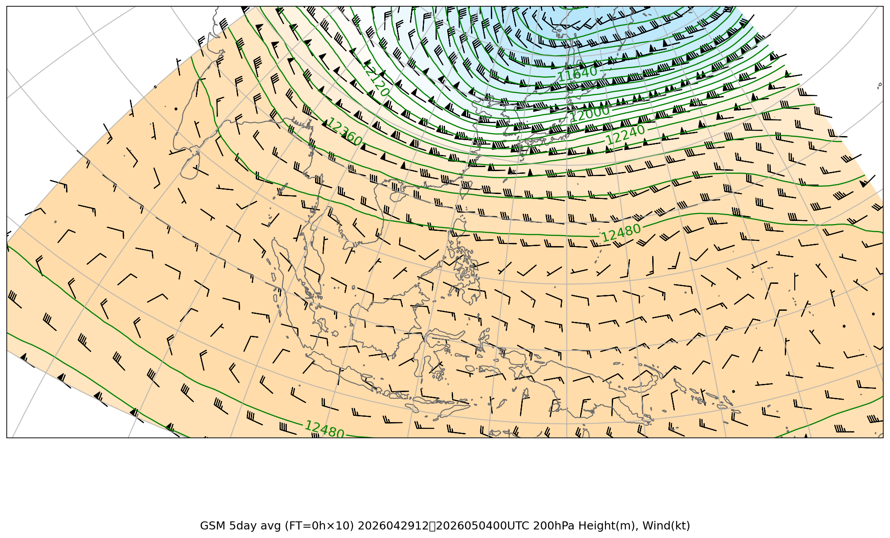
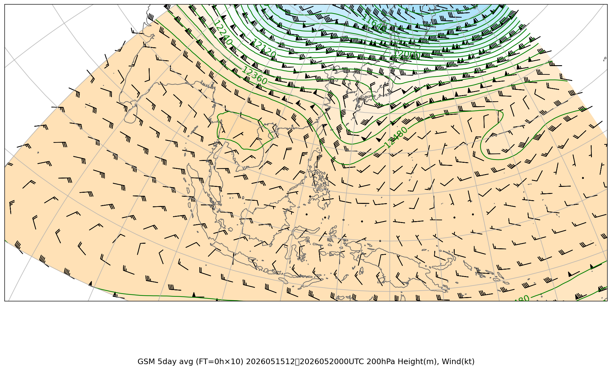
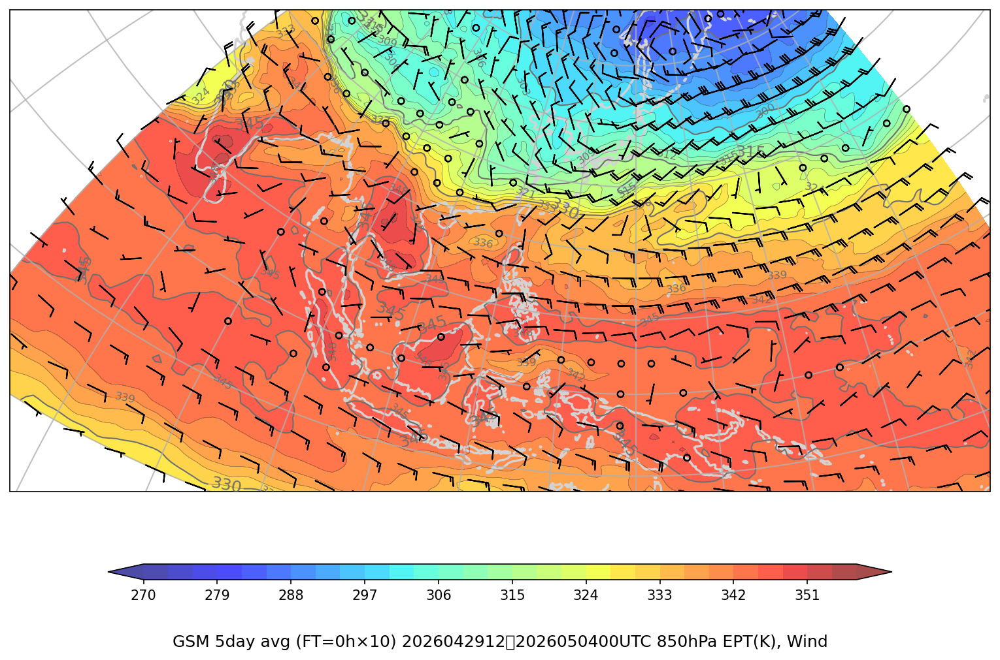
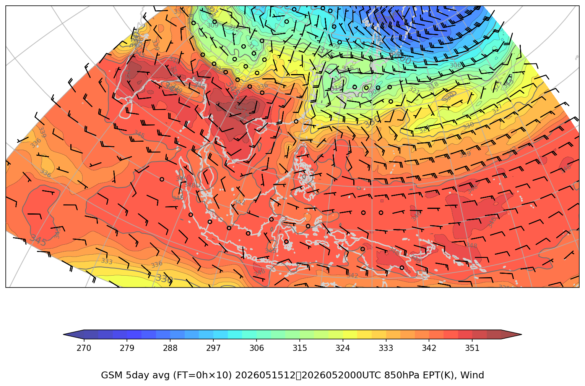

# ジェット・前線解析 複数初期時刻比較レポート

**対象初期時刻**: 2026/05/04 00UTC, 2026/05/20 00UTC, 2026/06/10 00UTC

---

## AVE報告（複数日平均）

### 上層風（300hPa + 200hPa + 100hPa）

#### 300hPa

| 初期時刻 | 画像 |
|---------|------|
| 2026/05/04 00UTC | （画像なし） |
| 2026/05/20 00UTC | （画像なし） |
| 2026/06/10 00UTC | （画像なし） |

#### 200hPa

| 初期時刻 | 画像 |
|---------|------|
| 2026/05/04 00UTC |  |
| 2026/05/20 00UTC |  |
| 2026/06/10 00UTC |  |

#### 100hPa

| 初期時刻 | 画像 |
|---------|------|
| 2026/05/04 00UTC |  |
| 2026/05/20 00UTC |  |
| 2026/06/10 00UTC |  |

### 850hPa 相当温位・風矢羽

| 初期時刻 | 画像 |
|---------|------|
| 2026/05/04 00UTC |  |
| 2026/05/20 00UTC |  |
| 2026/06/10 00UTC |  |

---
