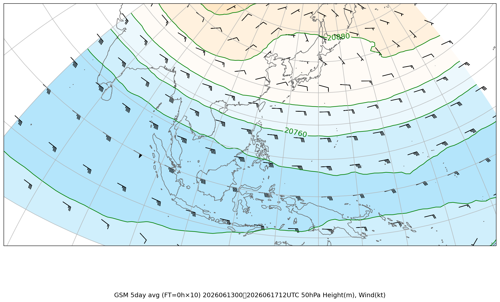
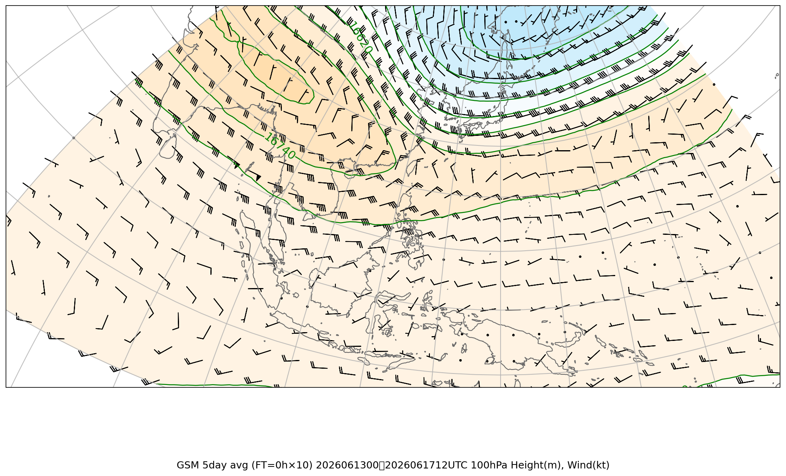
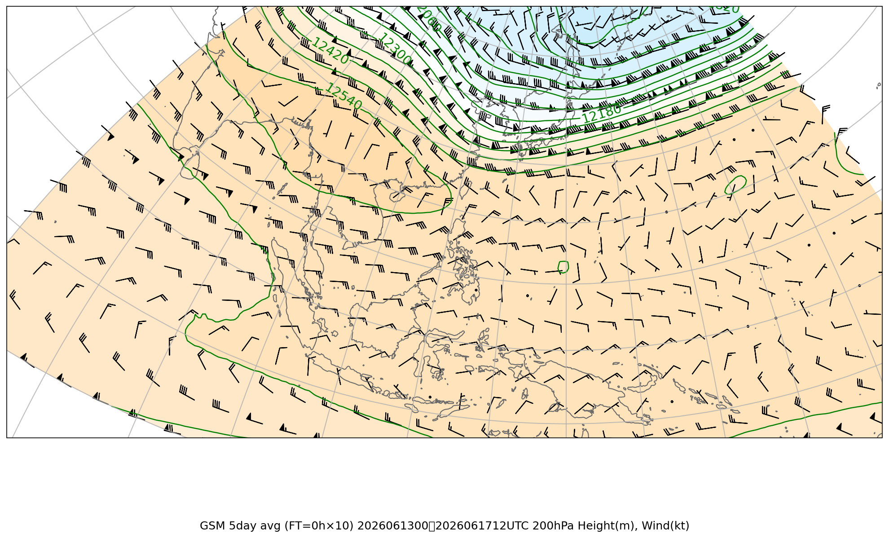
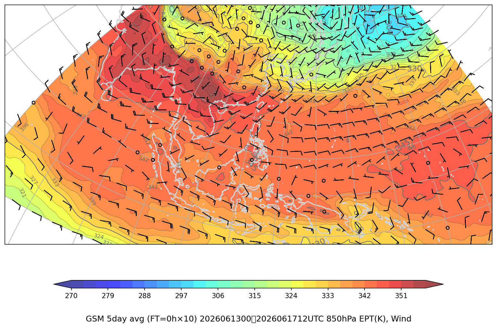

# ジェット・前線解析 複数初期時刻比較レポート

**対象初期時刻**: 2026/06/17 00UTC, 2026/06/17 12UTC

---

## AVE報告（複数日平均）

### 上層風（50hPa, 100hPa, 200hPa）

#### 50hPa

| 2026/06/17 00UTC | 2026/06/17 12UTC |
|---|---|
| （画像なし） |  |

#### 100hPa

| 2026/06/17 00UTC | 2026/06/17 12UTC |
|---|---|
|  |  |

#### 200hPa

| 2026/06/17 00UTC | 2026/06/17 12UTC |
|---|---|
| （画像なし） |  |

#### 850hPa 相当温位・風矢羽

| 2026/06/17 00UTC | 2026/06/17 12UTC |
|---|---|
|  |  |

---

## WIDE報告（広域）

### 上層風（50hPa, 100hPa, 200hPa）

#### 50hPa

| 2026/06/17 00UTC | 2026/06/17 12UTC |
|---|---|
| （画像なし） | （画像なし） |

#### 100hPa

| 2026/06/17 00UTC | 2026/06/17 12UTC |
|---|---|
| （画像なし） | （画像なし） |

#### 200hPa

| 2026/06/17 00UTC | 2026/06/17 12UTC |
|---|---|
| （画像なし） | （画像なし） |

#### 850hPa 相当温位・風矢羽

| 2026/06/17 00UTC | 2026/06/17 12UTC |
|---|---|
| （画像なし） | （画像なし） |

---
