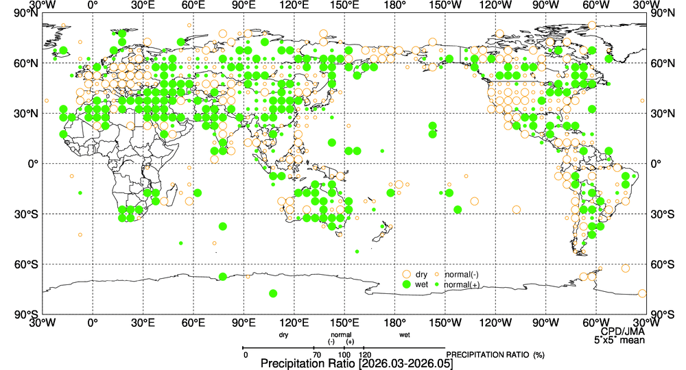

# TCC 3か月平均天候図レポート

**基準年月**: 202604
**種別**: 実況値＋平年偏差（hist）　※ 海面水温・降水量平年比はこの区別を持たず常に同一画像

気象庁 TCC（Tokyo Climate Center）が公開する季節予報の基本場資料。
※ 実際の3か月期間は要素グループによって基準年月の意味が異なる（気候システム監視系＝終了月／海面水温・降水量平年比＝中央月）ため、各画像の見出しに実期間を明記している。

---

## 降水量平年比

### 降水量平年比（季節、%、地上観測点）

**対象期間**: 2026年3〜5月

---

## 出典

- [気候システム監視 / 3-Month Mean Figures](https://ds.data.jma.go.jp/tcc/tcc/products/clisys/figures/db_hist_3mon_tcc.html)
- [El Nino Monitoring / Oceanographic Condition](https://ds.data.jma.go.jp/tcc/tcc/products/elnino/ocean/index_tcc.html)
- [World Climate / Seasonal Climate Maps](https://ds.data.jma.go.jp/tcc/tcc/products/climate/climfig/?tm=seasonal&el=gprt)